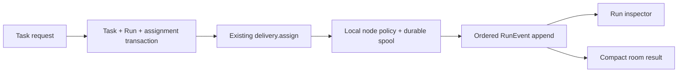

## ADR

Use an additive SQLite v2 migration in the deployed Node hub. A `Task` owns intent; one `Run` owns an attempt; append-only `RunEvent` rows own activity. A room receives only compact task/result messages. Keep the existing delivery transport as the run-assignment path until DAG scheduling is justified.

The rejected alternatives are a protocol-v2 rewrite, a separate workflow service, per-model adapters, and a 27-table schema. `node:sqlite` remains appropriate: it already supplies the single local database connection and transaction primitive; WAL remains the commit journal. [Node SQLite docs](https://nodejs.org/api/sqlite.html) [SQLite WAL format](https://sqlite.org/walformat.html)

Riskiest assumption: the current delivery envelope can carry a `run` assignment without breaking the Rust node. Prove it with a Node-hub/Rust-node fixture that creates a task, assigns its run, and persists an ordered event before acknowledging completion.

