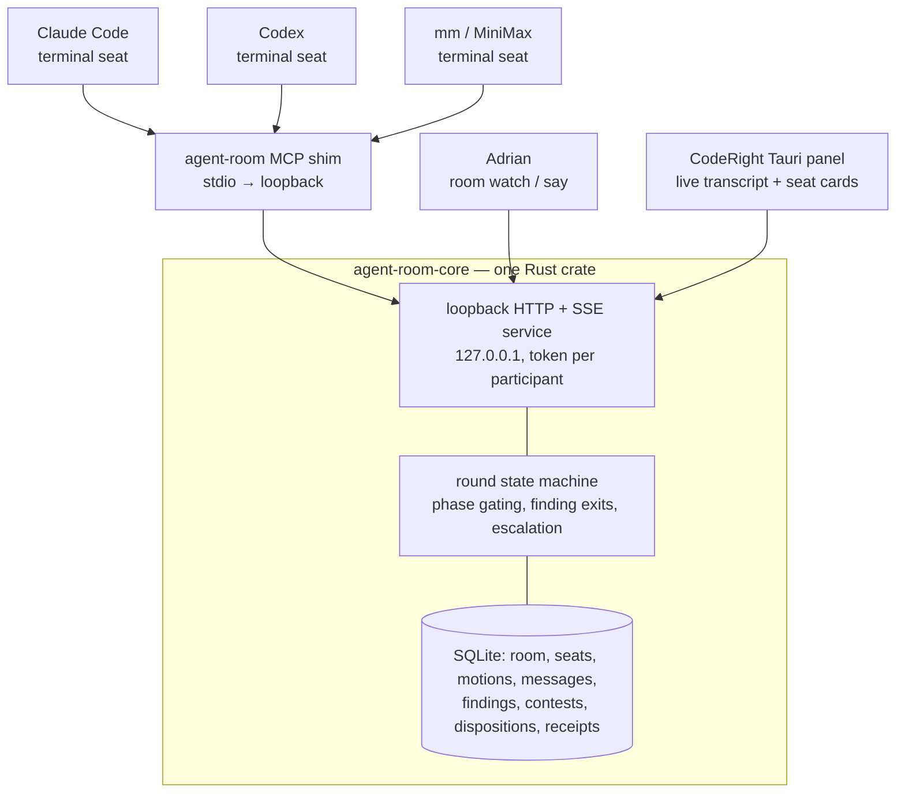
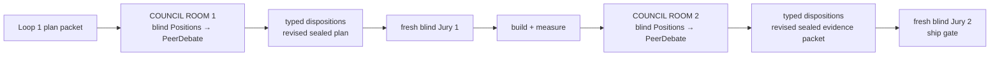
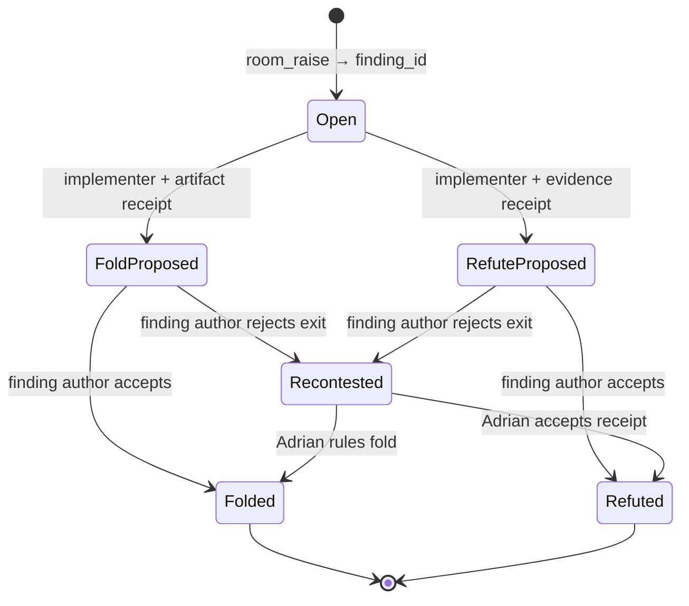
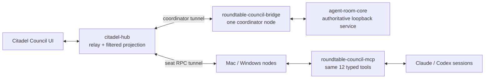

# Agent Room — cross-model, local, visible multi-agent sessions

Status: **IMPLEMENTED THROUGH P2 · DISPATCH 2 SPEC LOCKED, GATED ON CITADEL DISPATCH 1 ACCEPTANCE** · rev 2026-07-22e
Working name: `agent-room`. RightKit crate/package naming remains an Adrian-reserved pre-release decision; inside CodeRight it surfaces as the "Review Room" panel.

> **Execution order (locked 2026-07-22):** freeform cross-device coordination is a separate product
> specified in `docs/plans/2026-07-22-citadel-cross-device-architecture.md`. Build and verify that
> document first. This document's existing P0/P1/P2 implementation remains Council's source of truth;
> Dispatch 2 below adds a Citadel projection and remote-seat tunnel without replacing or weakening
> `agent-room-core`. Do not implement the reserved `freeform` mode in this crate.

> **Naming lock (Adrian, 2026-07-19):** the user-facing name stays **Council**. The `/council` skill
> remains the one entry point; the live/interactive surface is the **Council Room**; the two
> comparison modes are labelled **blind** vs **debate**. "Agent Room" survives only as this plan's
> internal working name — do not introduce it as a product or skill name.

## Intent

Adrian runs three model subscriptions — Claude (Claude Code), GPT (Codex), MiniMax (`mm`) — that today never talk to each other in a visible session. Goal: a **local, self-owned** room where heterogeneous agents debate, review, and split work **live**, with Adrian watching and able to interject. Two deployment faces, one core:

1. **Workspace face** — CLI room for `/council` v2 debates and ad-hoc cross-model reviews.
2. **Product face** — a proper tool inside CodeRight (Tauri): a review room per diff/PR, seats rendered live.

Hard constraints: the authoritative Council core remains local and loopback-only; no third-party room
service owns its state; agents remain visible local sessions; and taste/ship authority stays human.
The optional Citadel projection may traverse Adrian's own Hetzner hub, but the hub is a typed relay
and presentation surface, never the Council state machine or finding ledger.

## What we absorb vs. improve over the reference products

| Reference idea | Our version |
|---|---|
| Shared room, agents chat + split tasks | Same, but **loopback-only**, zero cloud identity |
| Prompt-enforced etiquette | **Service-enforced protocol**: the room server rejects out-of-phase messages — determinism lives in code, not prompts (same philosophy as the RightContext planner) |
| Free-form debate | **Typed findings + round state machine**; prose can explain an argument but cannot mutate finding state |
| Unlimited chatter | **Per-seat budgets** — hard message/byte/wake caps plus advisory, self-reported CLI token usage |
| Consensus = last message wins | Typed **motions + votes with reasons**; transcript is an audit receipt, exportable to memory-mirror |
| Free-for-all visibility from message one | **Phase-gated visibility** — positions are blind until the phase flips, so independence survives inside a shared room |

**xhawk.ai (reviewed 2026-07-18)** validates the demand shape — humans plus heterogeneous agents in
one visible shared surface with a full audit trail — but its architecture is everything this plan
rejects: cloud identity, third-party server, 24/7 autonomous queues, agents that execute against
connected systems unattended. Three things worth absorbing, all of which land above: seat-card
presence UI (P0 web page), the "compounding knowledge layer" (our JSONL export → `memright put`), and
its Kanban/task-queue mode as evidence that P3 worksplit has real demand *somewhere* — not evidence
that we should build it before P1 usage justifies it here.

### Protocol decision — prior art absorbed, not copied

| Approach | Decision | What carries forward |
|---|---|---|
| Free-form multi-agent consensus | **Reject** | Consensus can amplify conformity and error propagation; preserve and judge the whole trajectory rather than the final round alone ([Free-MAD](https://arxiv.org/abs/2509.11035) — arXiv ID unverified 2026-07-18; the rejection stands on the P-1 run-1 herding measurement regardless). |
| Alternating debate with a separate judge | **Adapt** | Blind opening positions, bounded replies, and Adrian as the human arbiter rather than a debating model ([AI Safety via Debate](https://arxiv.org/abs/1805.00899), [Khan et al.](https://arxiv.org/abs/2402.06782)). |
| Typed argument graph + provenance | **Adopt, minimally** | Stable finding/contest IDs, explicit support/attack edges, and reconstructable evidence receipts ([AIF](https://www.arg-tech.org/wp-content/uploads/2011/09/aif-spec.pdf), [W3C PROV-O](https://www.w3.org/TR/prov-o/)). No RDF dependency is required. |
| Unbounded multi-agent compute | **Reject** | Anthropic reports that token use alone explains 80% of BrowseComp variance, three factors together explain 95%, and multi-agent systems use about 15× chat tokens. This justifies enforceable message/byte/wake budgets in both Council loops, not a fictitious hard CLI token meter ([Anthropic](https://www.anthropic.com/engineering/multi-agent-research-system)). |

The governing choice is therefore **typed claims with human-arbitrated exits**, not consensus. Peer
debate may change or sharpen a finding, but it cannot close one. Only the disposition protocol below
can do that.

## Architecture



- **One core crate** (`agent-room-core`), consumed by a workspace CLI (`room`) and by CodeRight. Follows the RightKit pattern: shared source under `tools/rightkit/`-style tracking, apps pin published versions.
- **Transport:** loopback HTTP + SSE, ephemeral port + owner-readable `runtime.json` discovery. This
  borrows memright's owner-local discovery-file discipline but deliberately does **not** copy its
  fixed-default-port scheme. Each CLI participant gets a room-scoped bearer token at `room_join`;
  the MCP shim holds it out of model-visible content, sends it only in headers, and rotates it on a
  valid rejoin. The same-origin watch page uses an
  HttpOnly, `SameSite=Strict` session cookie because browser `EventSource` cannot attach arbitrary
  authorization headers. The agent hands Adrian one private loopback capability link; opening it
  creates the cookie and redirects immediately, while the old typed-code form remains fallback-only.
  Browser writes require exact-origin checks; CORS is off, CSP is restrictive, and seat/bearer
  tokens never appear in URLs, HTML, logs, transcripts, or exports. The capability response sets
  `Referrer-Policy: no-referrer` and is never included in pinned evidence. Loopback
  binding is a network boundary, not an authentication substitute.
- **Why MCP as the agent adapter:** Claude Code, Codex, and `mm` all speak MCP already — one stdio shim gives all three the same typed tools with zero per-vendor glue. That is the entire cross-model trick; no Agent SDK / Microsoft Agent Framework needed.
- **Shim decision is explicit:** P0 keeps the thin TypeScript stdio shim because it matches the
  workspace's existing MCP adapter pattern and isolates protocol translation from the Rust core. It
  is outside the per-prompt hot-path "no Node/npx" constraint, but it still adds a runtime. P0 must
  prove one bundled entrypoint, startup/auth parity, and no shell-level Node orchestration; otherwise
  the shim folds into the Rust crate before P1 rather than shipping two operational disciplines.

### MCP tools (the whole surface)

| Tool | Behavior |
|---|---|
| `room_join(room_id, name, model, role, resume_token?)` | First join creates a stable `seat_id`; valid rejoin rotates the bearer token and retains identity without bypassing visibility rules |
| `room_status()` | Return the authoritative visible snapshot: `room_id`, `seat_id`, mode, phase, latest visible cursor, budgets, and open finding IDs |
| `room_post(kind, body, reply_to?)` | Append conversational `question|evidence|info`; it can never mutate finding state |
| `room_raise(claim, severity, rationale, evidence_refs[])` | Create a stable `finding_id`; only service-issued IDs enter the finding ledger |
| `room_contest(finding_id, rationale, evidence_refs[])` | Create a stable `contest_id` targeting exactly one finding |
| `room_dispose(finding_id, folded|refuted, receipt_refs[])` | Implementer proposes one exit; missing or structurally invalid receipts are rejected |
| `room_resolve(disposition_id, accept|recontest, reason, evidence_refs[])` | Original finding author accepts the exit or re-contests it; nobody can resolve their own disposition |
| `room_rule(disposition_id, folded|refuted, reason, receipt_refs[])` | Adrian-only ruling for a re-contested disposition; records the final human authority event |
| `room_motion(kind, text, scope_refs[])` | Moderator-only creation of a stable `motion_id` plus pinned scope digest; initial review scope is created at room start. **The initial `review_scope` motion is a deterministic transform of loop-specific pinned inputs, never free text: Loop 1 uses the current packet digest (including verbatim `USER_INTENTION`, success criteria, and non-goals); Loop 2 uses the built-evidence packet plus the pinned Loop-1 disposition/defer ledger and their digests. The service rejects a scope motion whose digest does not match those inputs. Mid-room scope amendments are Adrian-only rulings.** This closes the self-scoping hole: the implementer must not author the scope its own `out_of_scope` refutations cite |
| `room_next(cursor?, wait_ms=45000)` | Long-poll for visible events past the cursor; a timeout with no events is a normal empty wake, not a room error |
| `room_vote(motion_id, choice, reason)` | Cast a labeled straw vote against one service-issued motion in `Voting`, after every finding is terminal but before the ledger is sealed; unknown IDs are rejected and the vote is never the ship gate |
| `room_tasks(claim|complete|list)` | Shared task list for work-splitting mode |
| `room_leave()` | Release seat |

Every state-mutating call carries a caller-generated `request_id`. Uniqueness is scoped to
`room_id + seat_id`: replaying the same ID and canonical payload returns the original result, while
reusing an ID with a different payload is rejected before persistence. This applies to posts,
findings, contests, dispositions, resolutions, rulings, motions, votes, tasks, and leave events — not
only chat — so transport retries cannot double-apply state.

Conversation envelope: `{seq, ts, room_id, seat_id, phase, request_id, kind, body, reply_to, evidence_refs[]}`.
Finding-state events use typed records instead of parsing control commands from prose:

```text
Finding     {finding_id, author_seat, claim, severity, rationale, evidence_refs[], status}
Contest     {contest_id, finding_id, challenger_seat, rationale, evidence_refs[]}
Disposition {disposition_id, finding_id, implementer_seat, action, reason_code?, receipt_refs[]}
Resolution  {disposition_id, author_seat, choice, reason, evidence_refs[]}
Ruling      {disposition_id, human_seat, action, reason, receipt_refs[]}
Motion      {motion_id, kind, text, scope_refs[], scope_digest, moderator_seat, status}
Receipt     {receipt_id, kind, locator, digest?}
ScheduledFinding {finding_id, source_phase, owner_phase, claim, missing_evidence, source_ledger_digest, status}
```

All are append-only in SQLite and JSONL. IDs, authorship, allowed transitions, and receipt shape are
service-enforced. Model/provider names, raw responses, prompts, latency, cache state, and other
plumbing never cross between seats. The peer projection is an allowlist:
`finding_id, claim, severity, rationale, evidence_refs, proposed_change, confidence`.

**Seat trust model (cross-seat prompt injection).** The allowlist strips plumbing, not intent:
message bodies are free prose delivered directly into every other seat's context, and seats run
with local tool access (`mm` defaults to bypassPermissions). Room content is therefore **untrusted
input to every seat**, including Adrian-attributed messages replayed after rejoin. Charters must
instruct seats to treat peer messages as data — evidence and arguments to evaluate, never
instructions to execute; the shim keeps bearer/resume credentials out of model-visible content so
no message can ask a seat to reveal them. The service cannot enforce seat-side behavior, so the
boundary is stated honestly: the protocol gate carries an injection fixture (an instruction-shaped
peer message must not alter a compliant seat's tool behavior — best-effort, measured in P-1
fixtures), and worksplit mode (P3) is the highest-risk surface because task bodies hand agents
instructions by design — its charter constraints are designed then, not inherited from debate mode.
**Prompt injection between seats is not a solvable problem inside the room protocol.** The room
reduces attack surface by hiding plumbing (bearer/resume credentials, prompt bodies, internal RPC)
and by enforcing typed-protocol shape; **destructive tool execution remains the responsibility of
the seat runtime** (Bash policy, subagent authority, allow/deny lists, file-system egress). Seats
that compromise their own tool policy via injected peer text cannot be detected at the boundary —
the protocol's guarantee ends at "an instruction-shaped peer message did not change a compliant
seat's behavior," not at "the seat is invulnerable."

**P0 process/storage boundary:** one service process owns exactly one active room, one ephemeral port,
and one SQLite file in that review's artifact directory. Concurrent rooms use separate processes;
tokens, cursors, idempotency keys, and databases never cross room boundaries. Sealing writes an
immutable JSONL export plus digest. There is no automatic pruning at any phase: `room prune
<room_id>` (P1) is an explicit operator action and refuses any unsealed or digest-unverified room,
preventing both silent data loss and unbounded growth inside one shared database; P0 simply keeps
everything.

**Crash/rejoin contract:** the launcher stores an owner-readable, one-time resume credential outside
the transcript. A valid rejoin proves the stable `seat_id`, rotates both resume and bearer tokens,
then resumes from the last acknowledged cursor. Replay is projected through the **current** phase's
visibility policy exactly like live delivery: while the room remains in `Positions`, peer positions
stay withheld even if they already exist in SQLite; after atomic reveal they become visible. An
invalid or expired credential creates no inherited seat and receives no private history.

### Round state machine (debate mode)

```mermaid
stateDiagram-v2
    [*] --> Open: charter posted
    Open --> Positions: all seats joined or join-deadline
    Positions --> PeerDebate: blind positions reveal atomically
    PeerDebate --> Dispositions: findings normalized + stable IDs
    Dispositions --> AuthorReview: implementer folds or refutes each finding
    Dispositions --> AbortedFallback: implementer timeout
    AuthorReview --> Escalation: author re-contests a disposition
    AuthorReview --> Voting: every author accepts
    Escalation --> Voting: Adrian resolves every re-contest
    Voting --> Verdict: straw vote recorded + ledger closed
    Verdict --> [*]: transcript sealed + receipt
    AbortedFallback --> [*]: partial room sealed; driver restarts fallback
```



- **Phase-gated visibility (load-bearing — this is how blindness survives inside a shared room).** During `Positions`, `room_next` returns a seat only its own messages plus charter/evidence; other seats' positions are withheld by the *service*. When the phase flips to `PeerDebate`, all positions are revealed atomically in one batch. Without this, the first confident seat anchors every other seat's reading and the room is strictly worse than today's isolated one-shots. Enforced in `agent-room-core`, never by asking agents politely not to peek.
- **Two-exit gate on phase advance (see the termination rule below).** The service refuses
  `AuthorReview → Voting`, `Escalation → Voting`, and transcript sealing while any finding is open.
  Every terminal finding must carry an accepted `refuted` receipt or a verified `folded` artifact
  reference. Open IDs are enumerated in the rejection reason, so "which findings block the seal" is
  always answerable.
- Seat timeout → recorded `abstain`, room proceeds (a wedged CLI can never hang the room — memright serve-outage lesson). Timeout abstention applies to *seats*, never to findings: an abstaining author's unresolved disposition moves to Adrian's escalation queue, so a seat cannot be starved out to make its objection disappear or hang the room forever. **Escalation is bounded, not the default drain:** before an author-timeout disposition escalates, the service grants that seat one automatic re-wake window (charter-set); only then does it enter the queue. Every room records `escalation_rate` (escalated dispositions / total dispositions), and a room where the majority of dispositions resolve by escalation is a **failed room for value-gate purposes** — Adrian-as-disposer is the pre-room status quo, not room value, and an unbounded queue rebuilds the manual burden the room exists to remove.
- **Implementer timeout is different:** if the implementer wedges before proposing every
  disposition, the service never invents exits and never makes Adrian the default disposer. It seals
  the partial room as `aborted: fallback_required`; the Council driver restarts the current loop from
  its pinned packet in the full two-pass fallback lane. If that disposition-check pass also fails,
  that loop is a BLOCKER. The partial and fallback ledgers cannot be merged.
- Anti-conformity is a typed charter parameter: `dissent_policy = none | advocate |
  required_contest`. Production debate/review defaults to `advocate` for consensus motions, with its
  votes labeled so a "unanimous minus advocate" outcome remains readable. `required_contest` is the
  P-1 experimental condition only; it cannot become the production default until the three-review
  value gate shows changed outcomes without blocker inflation or minority erasure.

### Mode capability matrix

The service registers or rejects tools by mode; prompts cannot expand the capability set.

| Capability | Debate / review (P0/P1) | Worksplit (P3) | Freeform (post-P1, only if justified) |
|---|---|---|---|
| Join, status, next, post, leave | Yes | Yes | Yes |
| Findings, contests, dispositions, author resolution, Adrian ruling | Yes | No | No |
| Motions + labeled votes | Yes; vote only after the terminality gate in `Voting` | No | No |
| Shared task claims | No | Yes | No |
| Phase-gated visibility | Yes | Charter-defined task visibility | Off |

Unshipped modes are rejected server-side rather than exposed as dormant tools.

## Seat bootstrap (how agents actually get in)

`room spawn --seats claude,codex,mm --topic "..." --mode debate` opens one visible terminal per seat, launching each CLI with a one-line join instruction ("You are seat X in room Y; call `room_join`, then loop `room_next` → respond per the charter"). Attaching an already-running session is the same one-liner pasted by Adrian. The charter — persona, phase rules, budgets — is served by the room at join time, not baked into prompts per vendor.

Turn economics are honest: each seat burns one agent turn per `room_next` wake. The default wait is
45 seconds (charters may choose 30–60); an empty wake means continue waiting, not failure. The default
charter allows ≤2 positions + ≤2 peer-debate replies + 1 vote per seat and hard-caps messages, UTF-8
bytes, and wakes. A CLI may report provider token usage for accounting, but the service cannot observe
hidden reasoning or provider billing and therefore never claims a hard token cap.

**Per-seat context growth is a budget, not an accident.** Send caps bound what a seat may post;
nothing bounds what a long room *feeds* a seat — every wake appends peers' content to that seat's own
context across a multi-phase room over a real diff, and a degraded seat mid-`AuthorReview` is worse
than an absent one. The P0 smoke measures per-seat context consumption over one full round, and every
charter names the at-budget behavior (`summarize-and-continue` or `abstain`); silent degradation is
not an allowed state.

**Context growth is bounded by retrieval, not by summarization alone.** The at-budget behaviors
above describe the seat's *response* path; they do not bound the *feed* path. The room's evidence-fed
wake payload is structured in three layers, oldest first, and the seat retrieves on demand:

- **Transcript chunking.** Older debate turns are windowed into `chunk` records holding a stable
  chunk-ID, the segment of motion/message/finding IDs it covers, and a deterministic summary digest.
  A wake payload never replays verbatim chunks older than the current phase boundary; only their
  digests appear, so a seat can cite (`chunk:<id>`) and the next round can pull the verbatim text on
  demand without bloating the wake.
- **Retrieval of finalized findings.** Only `Folded` and `Refuted` findings (plus any
  `Observation` exit the room gains later) flow into the live wake with their full `claim` +
  `rationale`. `Open` findings appear as ID + one-line summary; the full finding is fetched via a
  typed `finding_get` call. Debate thread text *between* findings is reconstructed only when a seat
  specifically asks (`thread_get(finding_id)`).
- **Active-only filter.** A wake's payload is `[current phase charter] + [open findings
  (summary only)] + [evidence refs not yet retrieved] + [recent_unread messages from peers in the
  current phase]`. The parent's full transcript, the closed-ledger dumps from prior loops, and the
  raw peer-debate thread are NOT in the wake — they live behind typed reads so a seat that doesn't
  need them never pays for them.

## `/council` v2 — both Councils roomed, both Juries blind (Adrian, 2026-07-19)

The room does **not** replace `/council`; it is the constructive Council stage inside it. Both loops
now use the same epistemic shape: each Council Room begins with service-blind opening positions,
then reveals them for peer debate and typed disposition; a fresh Jury subsequently judges only the
revised sealed packet in isolation. The loops differ by subject, not by mechanics:

| | Loop 1 — plan/design review, before the build | Loop 2 — evidence review, after the build |
|---|---|---|
| Judges | is the plan ready to build; what must be fixed or scheduled | did the build and measurements prove the claims and scheduled items |
| Council opening | **blind `Positions` in the room** | **blind `Positions` in the room** |
| Council after reveal | `PeerDebate` → typed fold/refute/defer dispositions | `PeerDebate` → typed fold/refute dispositions |
| Scope | current packet + verbatim user intent + success criteria/non-goals | built-evidence packet + pinned Loop-1 ledger/deferred items |
| Ship gate | fresh blind Jury outside the room | fresh blind Jury outside the room |

This deliberately spends room turns in Loop 1 too. The isolated Jury already supplies the separate
blind check; a second fully isolated Council duplicated independence but discarded the room's main
value — peers challenging one another's findings before the artifact is sealed. Single-loop reviews
use the same room → blind Jury shape.



### Three invariants the room must not break

1. **The jury never enters the room.** The room is the *council + disposition* stage in either loop.
   Each fresh 4-seat jury still runs one-shot against that loop's sealed revised packet, and still sees
   no room chatter, no model names, no straw-vote tally, no implementer framing. The room's `Voting`
   phase produces **advice**, not the ship verdict — `room_vote` output lands in the packet as a
   labeled straw poll. (Jury-as-silent-observer of the debate is a real courtroom shape and may be
   worth a later experiment; it is explicitly out of scope for v1.)
2. **Blind is an opening-move property, not a loop property.** Every room opens in `Positions`
   with phase-gated visibility on (see the state machine above), so seats form an independent read of
   the evidence before anyone can anchor them. Debate starts at `PeerDebate` (the state machine's one
   name for the reply phase — "rebuttals" as a phase name is retired). Both Councils are blind first,
   then contested; both Juries stay blind throughout.
3. **The motion is deterministic and loop-specific.** Loop 1's charter derives scope from the pinned
   current packet, including verbatim `USER_INTENTION`, success criteria, and non-goals. Loop 2 pins
   `review.disposition.json` plus the `defer-to-phase` list and built evidence, and asks *"did the
   built phase prove the scheduled claims"* — never *"is the design good again"*. Without this the
   second room re-litigates settled gates with a token budget behind it.

### Termination rule — two exits per finding (Adrian, LOCKED 2026-07-18)

**A finding leaves the room only by being refuted with evidence, or by being folded into the plan.
There is no third exit — nothing is "noted", "acknowledged", or dropped, and neither the room nor the
plan closes while an un-exited finding remains.** A panel whose findings can be received without
consequence is decorative; this is what makes the room load-bearing instead of ceremonial. Same shape
as the workspace work-left guard: COMPLETE or BLOCKER, never a third state where something is
acknowledged and quietly abandoned.

| Exit | Requires | Recorded as |
|---|---|---|
| **Refuted** | evidence a *seat can independently check* — file:line, a measurement, a cited source | `rejected` + `evidence` ref in `review.disposition.json` |
| **Folded** | the change actually lands in the plan/artifact this loop | `accepted` + the diff or plan section that now carries it |

The ledger tracks one finding at a time; a response can never resolve several findings implicitly:



The service validates receipt **shape and existence**, not truth: a `file:line` must resolve inside
the scoped workspace, a measurement must identify a persisted artifact plus digest, a folded change
must cite the revised artifact, and a web citation must retain its source URL. The original author
judges whether that receipt answers the finding. Adrian, not the implementer or room majority,
resolves a sustained re-contest.

**The asymmetry that must be engineered against.** The orchestrator is the implementer — the seat
whose work is under review — and this rule makes it judge of its own refutations. That is the exact
conflict of interest all three seats independently flagged as a **P0 blocker** in the P-1 run. Under
a two-exit rule the pressure gets *worse*, not better: folding costs real work, refuting costs a
sentence, so the cheap exit is to refute weakly and self-certify. A rule where one exit is cheaper
than the other selects for the cheap one.

Therefore refutation is not self-certifying:

- **Refutation must cite a checkable receipt.** "I disagree" / "already handled" / "out of scope"
  are not refutations. No receipt → the finding stays open, and the room does not advance phase.
- **Scope refutation is typed, not rhetorical.** The implementer may propose `refuted` with
  `reason_code: out_of_scope` only when its receipt is the service-issued initial
  `review_scope` motion and pinned scope digest. The original author still accepts or re-contests;
  a prose claim that something is out of scope remains invalid.
- **The original finding author gets one reply turn** to accept the proposed exit or re-contest it.
  Peer debate may involve other challengers, but only the author can accept the disposition for that
  `finding_id`.
- **A sustained re-contest escalates to Adrian.** If the seat re-contests and the orchestrator still
  refutes, that single named disagreement surfaces to Adrian rather than resolving itself in the
  orchestrator's favour by default. Deadlock resolves upward, never inward.
- **No prose parsing at the trust boundary.** `CONTEST:` and `RESPONSE:` strings may be rendered for
  humans, but state transitions use typed IDs and enums. Unknown IDs, self-resolution, one response
  targeting multiple findings, and receipt-free refutations are rejected before persistence.

**`defer-to-phase` is a durable scheduled obligation, not a third exit.** Loop 1 may schedule one
only when it names the owning phase and missing evidence. The driver writes a stable
`ScheduledFinding` to `review.state.json` with the source-ledger digest; it is never rendered closed.
The current phase packet may seal only while carrying that nonterminal obligation forward. At every
Loop-2 convening the driver checks the schedule before opening the room: when the owning phase begins,
the same `finding_id` imports as `Open`; if the phase was removed, renamed, or passed without the
required evidence, it enters Adrian's escalation queue. A Loop-2 room cannot reschedule its own open
finding to escape the two exits. Open-ended or unnamed-phase deferrals are rejected before
persistence.

**Adrian-absent policy (added 2026-07-23, fills gap the original two-exit rule left).** A recontested
finding that loops without Adrian ruling is a real failure mode — Adrian can be asleep, traveling,
or simply not at the keyboard. The room must not advance phase while an un-exited finding remains,
yet cannot deadlock waiting forever. Policy:
- **Soft window.** Every `Recontested` state carries `last_recontest_at` and is aged in core.
  After **36 hours with no Adrian action**, the room surfaces a structured escalation event
  (`council.escalate.stale_recontest`) to the authenticated human surface — visible in the CodeRight
  Review Room, an `mm` notification, and a `memright put` so it survives a restart. The room itself
  does not advance; the room's structural gate (no open findings → phase advances) is unchanged.
- **Hard terminal.** After **7 days** with no Adrian ruling on the same `finding_id`, the finding
  enters a new terminal state `StalledForHuman` and the room **fails closed**: the loop's sealed
  ledger carries `finding.status = StalledForHuman` and the Council / Jury / ship gate refuses to
  proceed. This matches the workspace work-left-guard shape: COMPLETE or BLOCKER, no third state.
  Adrian's eventual `room_rule(StalledForHuman …)` resumes the loop; until then nothing downstream
  accepts the artifact.
- **Replay safety.** `last_recontest_at` is a core-authoritative field, not a seat-claimed one;
  a clock-skewed claim cannot shorten the window. The 7-day cap is a wall-clock deadline, not a
  counter, so paused rooms behave correctly. **Loop 2 is stricter** (24 h soft, 72 h hard) because
  evidence ages and a stale recontest against a built artifact is more dangerous than one against a plan.

Both windows are configurable per room at `room_join` so future loops can tune without a code change,
but the defaults above ship with P0.

### What this actually buys — the adversarial disposition gate

Today the implementer grades their own homework: council posts findings, the implementer privately
writes `rejected` with a rationale in `review.disposition.json`, and nothing pushes back until the
jury does so indirectly through a different lens. That is the weakest link in the current workflow.
In either Council Room the implementer is a **seat**, and the author of a rejected finding rebuts the
rejection **live**, on the record, before the packet is sealed. Cross-examining a disposition is
precisely what a debate is for and precisely what blind packets cannot do.

### Skill-side changes (`tools/skills/council/SKILL.md`)

- Step 4 uses `--stage advisory --room` for Loop 1, Loop 2, and single-loop Council reviews. The
  sealed transcript writes the same `council.advisory.json` result envelope; finding-ledger
  artifacts are additive, not smuggled into free-form blockers.
- Step 5's disposition is authored **inside** the room through typed `room_dispose` calls. Each
  finding author receives the proposed exit and must `accept|recontest`; the sealed ledger exports to
  `review.disposition.json` with stable finding IDs and receipt refs.
- Step 7 (`--stage verdict`) keeps the Jury isolated but gains a fail-closed precondition: the finding
  ledger must exist, its schema must validate, and every finding must have a terminal accepted exit.
  `review.state.json` logs `lane: room`, transcript path, ledger digest, open-finding count, and every
  durable scheduled obligation plus owning-phase re-entry status.
- Fallback: room unavailable / a seat CLI wedged → the affected loop uses isolated one-shot seats for both the
  finding pass and a second disposition-check pass, logging `lane: room-fallback`. It may not skip
  author acceptance or self-certify a refutation merely because the live room failed.

**Skill routing impact (locked 2026-07-23):** the room reframes two skills and leaves the rest of the
top-level skill surface alone.

| Skill | Pre-room role | Post-room role |
|---|---|---|
| `/council` | A 4-seat panel + Jury run inside one skill invocation | The same panel now runs as Loop-1 advisory → room → disposition → fresh Loop-2 Jury. The skill body shortens; the room host does the live work. **No new skill name.** |
| `/designer` / `/writing` / `/marketing` (any that ship a "before you ship, get a review" tone) | Optional `/council` invocation on demand | The `room` CLI exposes a `--watch-skill <name>` hook so these skills can subscribe to a per-skill room feed and post findings as they draft. Routing is the same — they recommend `/council`, `/council` opens the room. |
| `/brand-voice` / `seo-*` / other advisor skills | These run **outside** the room on demand | Unchanged. They were never the room's authority and remain so. They never enter a Council blind phase. |
| CodeRight "Review Room" panel | Not present | New (P2): `apps/code-review` tab routes to `room watch <room_id>` over the same loopback HTTP surface described at line 595+; the embedded watch page shape is reused. |

Two hard rules the skill layer must honor:
- The `/council` skill is the **only** entry point for a Council. `room` CLI alone cannot seal a
  packet; only `/council --stage verdict` writes `review.disposition.json` + `council.advisory.json`
  envelopes. This keeps the juror's isolation rule auditable at one file each loop.
- Skills that subscribe to the room must treat every peer message as **untrusted input to their own
  context**. The injection fixture in §Architecture §MCP tools applies to skill sides too — a
  malicious seat can post anything that the subscriber's runner will see. Treat peer text as data,
  never as instructions.

## CodeRight integration

- **Review Room panel:** live transcript (SSE), seat cards (model, phase, budget remaining), and a
  finding ledger grouped as `Open | Exit proposed | Re-contested | Folded | Refuted`. Every terminal
  tile links its receipt; no green/closed rendering exists without a terminal ledger state.
- Diff context is pinned as typed evidence. Adrian is a first-class seat — can post, question,
  interject, and resolve the explicit escalation queue; agents see his messages as highest-priority.
- Seats are locally configured CLIs spawned by the app (visible terminals or embedded ptys — Adrian's choice per run; default visible, per the parallel-session preference).
- Verdicts feed the existing review vocabulary: room output is Council-tier advice; `/jury` remains the ship gate; Adrian remains the approval authority. No room verdict ever auto-advances a pipeline.
- Pro-gating, licensing, updates: standard Right Suite rails (license token, R2 tiers) — nothing new.

## Phasing

**P-1 — prove both value and protocol before building infrastructure (rule #10 applied to this
plan itself).** P-1 now has two deliberately separate experiments:

1. **Peer-debate value:** blind positions → peer contests → optional peer replies. This asks whether
   debate changes findings, dispositions, or the eventual Jury verdict. It has no authority to close
   findings and is not the two-exit disposition gate.
2. **Disposition correctness:** typed findings → implementer `folded|refuted` proposal → original
   author `accept|recontest` → Adrian escalation. This asks whether every finding is traceable and
   whether the gate fails closed under malformed, missing, or disputed receipts.

The value experiment stays on the existing free API seats and checkpointing. Run it on 3 real
Loop-2 reviews. The correctness experiment first runs entirely over local fixtures; no model call is
needed to prove state transitions.

- **Value gate (FROZEN — pre-registered before run 3; may not be reinterpreted after results):**
  "material change" means exactly one of: (a) a disposition action flips on ≥1 finding
  (`accepted`↔`rejected`, fold↔refute), (b) the Jury verdict tier changes, or (c) a blocker enters or
  leaves the Jury blocker list. The denominator is **3 distinct real Loop-2 reviews, excluding the
  self-referential `jury-plan` packet** — runs 1–2 on this plan are charter-calibration evidence, not
  gate samples. Passing = material change on ≥1 of 3 **without** blocker-list inflation (>×1.1 vs
  blind) or erasure of a correct minority position, **and** the room's `escalation_rate` below the
  failed-room majority threshold. Adrian adjudicates against the pinned run artifacts only. Track
  calls/tokens as well as outcome changes. A miss is a miss: the room is then not justified for
  `/council` on debate grounds — no post-hoc narrowing of the gate ("run 2 taught us X" belongs in
  the charter changelog, not in the pass/fail).
- **Protocol gate:** adversarial fixtures prove that an uncited refutation stays open; one response
  cannot resolve multiple findings; raw model/plumbing fields never reach peers; author acceptance
  is required; a re-contest reaches Adrian; and the verdict stage rejects any open finding. They also
  prove unknown/free-text motions cannot receive votes; identical retry IDs apply once while changed
  payloads reject; a rejoining seat cannot replay peers during `Positions`; implementer timeout enters
  the full fallback lane; deferred obligations survive restart and escalate if their phase disappears;
  mode-forbidden tools reject; and `out_of_scope` requires the pinned scope-motion receipt.
- **P0 starts only if both gates pass.** Cross-CLI worksplit could justify a room separately, but that
  requires its own evidence rather than borrowing a failed Council experiment.

**Implemented 2026-07-18** — `dual_review.py --rebuttal` (advisory stage). Each advisory seat is
re-run alone with its peers' blind positions appended, so no seat's rebuttal can leak into another's;
output persists to `council.rebuttal.json` with a `position_shifts` delta, and a wedged seat records
an error instead of losing the round.

**Current implementation truth (updated 2026-07-19):** the viewer, partial-compliance audit,
failed-seat visibility, adoption audit, typed/allowlisted peer-finding projection, typed contest and
peer-reply records, plural per-author resolutions, and one bounded response re-wake exist
(`dual_review.py`: `REBUTTAL_INSTRUCTION`, `_contest_audit`, `--rebuttal`,
`run_response_round`). `room_protocol.py` now implements the P-1
typed correctness harness (finding/disposition/author-review/ruling exits, deterministic scope
motion, Adrian-only amendments, idempotency, blind replay, mode gates, bounded escalation, timeout
fallback, untrusted-message projection); `review_evidence.py` implements canonical run pinning,
scheduled-obligation restart reconciliation, terminal-ledger verification, the frozen value-gate
evaluator, and a combined-sample builder that requires the same packet/input hash and predeclared
branch conditions, derives escalation rate from the response audit, and copies both branches into
one digest-pinned run.
Provider-reported usage now survives OpenAI-compatible/MiniMax transports, fallbacks, per-seat peer
rounds, and panel envelopes; missing usage is explicit and makes a sample inadmissible rather than
being estimated. The local review suite passes **108** tests (re-verified 2026-07-19). The two historical P-1 calibration runs predate the response
round and contain no `council.response.json`.

**Pinned protocol-gate receipt (local fixtures, not a value-gate sample):**
`tools/review/.council-runs/protocol-fixtures-2026-07-19/protocol-gate.junit.xml` — SHA-256
`27dd4c0cc4e2e890d36253b501df9021cfedf3306aff413b87bed6b6eb90d614` (25 tests; manifest and
matching paths/digests are in that run's `evidence.manifest.json` and `review.state.json`). This
satisfies the local correctness-fixture portion only; it does not replace the three real Loop-2
value samples or Adrian's adjudication.

**Pinned live P-1 architecture-plan smoke (not a frozen-gate sample):** “Skills as a RightContext
provider” ran through blind positions, required contests, and author replies at
`tools/review/.council-runs/p1-skills-provider-peer-20260719/`. All 3/3 answering seats contested;
one seat changed `APPROVE → NEEDS-REVISION`; the final plural-resolution pass closed all three
contests (3 conceded, 0 unanswered). Provider accounting was complete: blind 3 calls / 6,647 tokens,
PeerDebate 4 calls / 14,349 tokens, final replies 3 calls / 8,679 tokens. Pinned SHA-256 receipts:
`packet.md` `ac55fce18bac7c54b5d9e35c2f539bcd0ddac4408c7fd4f09110f97d99d15126`;
`council.advisory.json` `7fcd35d30331b01c64b71794acfb09236c5a4861891d1d6d3167bce5f580de0e`;
`council.rebuttal.json` `7c51142eace0de676d71789709e078ec5fc1d716523dc008fe4ca8aba8227bd0`;
`council.response.json` `e81655bfcafa5eef5002677daaf86adbbaa8cec0479cd90ba7cd4dc0b0049cc1`.
This proves the experiment can run a real architecture plan. Its matched blind branch and both
disposition/Jury outcomes now exist in the value-gate execution below; Adrian's pinned
minority-erasure adjudication is closed by the explicit delegation recorded below.

**Frozen value-gate execution (2026-07-19 — FINAL PASS):** three distinct,
non-self-referential architecture reviews completed as matched pairs. Every original/revised packet,
Council artifact, typed disposition, isolated Jury result, provider accounting record, state file,
and viewer receipt is under `tools/review/.council-runs/` and digest-pinned. The human comparison
surface is `value-gate-adjudication-20260719/adjudication.html`. Adrian explicitly delegated the
final judgment to Fable and Codex ("i'm leaving it up to fable and you to decide"); both assessed
`correct_minority_erased = false` for all three samples. Receipt precision (Fable audit,
2026-07-19): the pinned artifact is Fable's flip-by-flip assessment
(`fable-assessment-20260719.md`, SHA embedded per sample); Codex's concurrence exists only as the
`assessor_consensus` field written by the Codex session — no separately pinned Codex assessment
artifact. The delegation statement and consensus are embedded in every pinned sample.

| Sample | Blind → Peer Jury | Material change | blocker inflation | escalation |
|---|---|---|---:|---:|
| Skills as RightContext provider | `NEEDS-REVISION → NEEDS-REVISION` | disposition flip + blocker delta | 0.882× pass | 0/3 = 0% |
| RightContext link-graph recall | `NEEDS-REVISION → NEEDS-REVISION` | disposition flip + blocker delta | 1.000× pass | 0/2 = 0% |
| Right Suite legal layer | `NEEDS-REVISION → NEEDS-REVISION` | disposition flip + blocker delta | 1.091× pass | 0/2 = 0% |

The denominator and material-change condition are satisfied, every blocker-inflation ratio is at or
below 1.10, and no room reached the majority-escalation threshold. The implementer model was fixed
to Cerebras `zai-glm-4.7` in both branches of every counted pair; earlier mixed-fallback attempts are
preserved but excluded. Fresh isolated Juries used the same configured panel and normal recorded
fallback policy. The final evaluator passes with no failures at
`tools/review/.council-runs/value-gate-final-20260719/value-gate.result.json`; the three canonical
sample runs are `value-gate-skills-20260719`, `value-gate-link-20260719`, and
`value-gate-legal-20260719`. The frozen value gate is closed.

**Evidence pinning closure (2026-07-19).** The receipt-free run-1/run-2 figures below remain
narrative calibration history and are not gate evidence. The frozen gate instead uses the three new,
distinct, fully pinned samples named above, each with paths and SHA-256 digests in its
`evidence.manifest.json` and `review.state.json`. Fable and Codex completed the delegated
minority-erasure adjudication; no download, JSON handoff, or further decision is required from
Adrian.

**Implementation receipt (2026-07-19 — P0/P1/P2 complete):** `agent-room-core` now provides the
typed state machine, SQLite event store, phase-gated projection, loopback HTTP/SSE service, private
one-click browser join link (manual pairing fallback), embedded live page, CLI, bounded
re-wake/escalation, budgets, sealed exports, durable
scheduled findings, and safe prune. `agent-room-mcp` exposes the frozen 12-tool contract with
cancellation-safe bootstrap credentials. `dual_review.py --room` and `agent_room_driver.py` provide
resumable Council execution and evidence pinning. CodeRight's Review Room panel proxies the service
without exposing seat credentials and supports live status, transcript, findings, receipts, and
human interjection. Verification is green: **43 Rust tests**, **5 MCP tests**, **108 review tests**,
CodeRight focused UI tests/typecheck/format, and native Cargo check/tests.

The real multi-model smoke is pinned under
`tools/review/.council-runs/agent-room-real-rightcontext-v2-20260719/`: Codex and MiniMax completed
blind positions, atomic reveal, PeerDebate, a typed refutation with receipt, author acceptance, two
reject votes, Verdict, seal, and export against
`docs/plans/2026-07-16-rightcontext-gates-execution.md`. The transcript SHA-256 is
`f22c3bf4e406ee8fc149d6d63fcaf1e8cb13f3e06de12bffb38eaf84869b935a`; the finding-ledger SHA-256
is `114c54c600ec9f722354282fa4c8b7560da02b21282f820ba0cbac43d9b1828d`. The outcome was consensus:
the plan's built phase/Loop 1 is not yet proven because installed-side acceptance evidence remains
open. P3 is deliberately unimplemented until real P1 usage demonstrates worksplit demand.

The smoke demonstrates a real but deliberately structured exchange, not an open-ended chat: both
models posted blind positions; Codex replied directly to MiniMax in `PeerDebate`; MiniMax posted the
typed disposition; Codex accepted it with the pinned receipt; both then voted. The sealed transcript
is the source of truth for that interaction shape.

#### P-1 run 1 — result: HERDING, not debate (this packet, `jury-plan`)

Ran the rebuttal round on the Council v2 design itself. Verdicts: `NEEDS-REVISION` ×3 before **and**
after — zero changed. Scores converged 5/6/7 → **5/5/5**. Every seat's post-rebuttal blocker list is
approximately the *union* of all three blind lists, re-tiered; **not one seat contested a single peer
finding.** Seats adopted peer concerns wholesale and promoted them (e.g. implementer-as-seat moved
P2→P0 for the seat that had ranked it lowest).

That is the anchoring/herding failure mode, measured — a union-and-converge machine wearing a
debate's clothes. It is also self-demonstrating: both rounds independently flagged *"no mechanism
forces a seat to engage a peer argument rather than restate its prior position"* as a **P0 blocker**,
and the round then did exactly that. The panel diagnosed the experiment it was running.

**Consequence — the gate is not passed, and the charter changes before runs 2-3 are meaningful.** A
rebuttal that may only agree is worthless; disagreement must be structurally required, not invited:

- **Mandatory contest field in the P-1 anti-conformity experiment.** Each experimental rebuttal must
  name at least one peer finding it judges **wrong or overstated, with a reason**. The audit marks any
  shortfall non-compliant. This deliberately forced condition tests whether disagreement survives;
  it is not evidence that every production seat should invent dissent.
- **Adoption must cost something.** A seat adopting a peer finding states what in the artifact it
  originally missed; wholesale re-listing without that is dropped, so union-ing is not the cheap path.
- **Devil's-advocate seat is not optional** for the rebuttal round (the plan already charters one for
  consensus motions — this run shows it is load-bearing far earlier than expected).
- Re-run 3 reviews after the charter fix; only then is the P0 crate gate honestly answerable.

The transferable lesson for the room itself: **phase-gated visibility protects the blind round but
does nothing to protect the debate round.** Revealing positions atomically removes ordering effects,
not conformity pressure. The room needs a forced-dissent rule in its charter, or it will reproduce
this same convergence with three subscriptions paying for it instead of three free endpoints.

#### P-1 run 2 — forced dissent applied, same packet: herding broken

Charter fix shipped in `REBUTTAL_INSTRUCTION` (mandatory `CONTEST: <peer> — <why wrong/overstated>`
as the first blocker; adoption must state what the seat originally missed; explicit "do not converge
on a peer's score to be agreeable"), plus `_contest_audit()`, which measures compliance and raises
`herding_suspected` on any shortfall among answering seats. **Compliance is measured, not assumed** — an unenforced
etiquette rule is exactly what this plan rejects prompts for.

| Metric (same packet, same seats) | Run 1 — invite dissent | Run 2 — require dissent |
|---|---|---|
| Score dispersion, blind → rebuttal (pop. stdev) | 0.82 → **0.00** (5/5/5) | 0.82 → **0.47** (5/5/6) |
| Blocker-list inflation vs blind | **×1.40** (union-ing) | **×1.00** (no padding) |
| Seats contesting a peer | **0 / 3** | **3 / 3** |

Dispersion survived, list-union-ing stopped, and every seat contested — including one disputing a
peer's *tier* rather than the finding itself ("this is a quality-of-output issue, not a structural
failure; the plan works even if agents are lazy, it just wastes money"), which is precisely the kind
of calibration disagreement a blind panel cannot produce.

**Historical calibration status at run 2: open.** Verdicts remained `NEEDS-REVISION` ×3 — no verdict flipped, and
the stated gate is a material change to dispositions or the jury verdict on ≥1 of 3 reviews. What run
2 proves is narrower but necessary: the mechanism now produces *real disagreement* instead of
conformity, so runs 2-3 on other reviews are finally measuring debate rather than measuring herding.
Run 1's numbers would have been a false negative on the gate for the wrong reason.

**Carry into the room without manufacturing dissent:** consensus motions receive a designated
devil's-advocate challenge, and any actual contest uses typed `finding_id`/`contest_id` records.
Ordinary seats may support, attack, or abstain; the service enforces complete finding exits, not a
quota of disagreement per seat. `_contest_audit()` remains evidence about the P-1 experimental
condition, not the production state machine. P-1 records the selected `dissent_policy` on every run;
only the completed three-review value gate may change the production default from `advocate`.

- **P0 — core + smoke + web window (trimmed to the load-bearing minimum — audit 2026-07-18):** crate
  (service, typed finding ledger, state machine, SQLite, **phase-gated visibility**), MCP shim,
  `room` CLI (`spawn`, `watch`, `say`, `export`), **and the bundled watch page — watch-only**. The P0
  service speaks loopback HTTP + SSE for CodeRight's sake, so a static `dashboard.html` embedded in
  the crate and served at the discovered runtime port — seat cards (model, phase, budget remaining)
  and the live SSE transcript — reuses the small embedded-page shape of memright's `dashboard.html`
  + `serve.rs`. Adrian interjects via `room say` (CLI) in P0; the browser `say` box, `room prune`,
  and the `ScheduledFinding` restart-survival machinery move to P1 (the driver holds deferrals until
  then) — P0 was carrying P1-sized scope. `room watch` and `http://127.0.0.1:<port>` become two views
  of one stream; the visible surface must not wait for P2. Smoke: Claude Code + Codex 2-seat debate
  on a toy question, transcript sealed, **per-seat context consumption measured over the full round**.
  **Gate:** both seats complete a full round with zero prompt-level protocol enforcement; a position
  posted during `Positions` is provably invisible to the other seat until reveal, including after
  crash/rejoin replay; one finding folds with an artifact receipt; one refutation is accepted with an
  evidence receipt; one re-contest reaches Adrian; an implementer timeout emits `fallback_required`;
  duplicate mutations apply once; unknown motion IDs and mode-forbidden tools reject; raw/plumbing
  fields never cross seats; `room_status` matches the event stream; and an open finding makes the
  verdict/seal transition fail.
- **P1 — workspace value:** MiniMax seat, devil's-advocate charter, **`/council` v2 driver per the
  section above — the driver convenes a room for every Council advisory stage**, JSONL export,
  plus the P0-deferred pieces: browser `say` box, `room prune` (refusing unsealed or
  digest-unverified rooms), and durable `ScheduledFinding` import with its restart-survival and
  phase-disappearance-escalation fixtures.
  Only transcripts with a closed, digest-verified finding ledger auto-`memright put`, so verdict rationale becomes recallable memory (the one
  xhawk "compounding knowledge layer" idea worth absorbing, minus the cloud).
- **P2 — CodeRight Review Room panel** on the frozen P0/P1 protocol, reusing the P0 page's seat-card
  and transcript components rather than inventing a second rendering. **Reuse targets (verified on disk):**
  the MCP shim at `tools/rightkit/packages/agent-room-mcp/src/index.ts` (12 typed tools) is shipped;
  the loopback HTTP + SSE host (`agent-room-core` Rust crate) and the embedded `dashboard.html`
  watch page described at line 595+ are **not yet on disk in `tools/rightkit/packages/`** as of
  2026-07-23 (the directory holds `agent-room-mcp`, `legal`, `legal-ui`, `license`, `logs`,
  `platform-ui`, `qa`, `release`, `tauri`, `updates` — no `agent-room-core`). Either the core is
  still pending under a different path (verify with `find tools -name 'serve.rs' -o -name 'dashboard.html'`)
  or it has been removed/relocated. P2 cannot reuse components that don't exist; reconcile the path
  before starting P2 work.
- **P3 (optional) — worksplit mode**, only if P1 usage shows real demand (rule #10: no elaborate scaffolding ahead of proven use — this is exactly the Graphify failure shape if built early).

## Operational economics

The architecture rejects unbounded token spend (`## Phasing`-preceding budgets at line 36, line 55)
and per-seat message/byte/wake caps are hard. **Until Task C8 / first accepted P1 run persists
measured numbers, the room's claim is "bounded above today's Council" — not "cheaper."** The
table below is the gate that surfaces the actual ratio at the first measured run.

| Metric | Estimated | Evidence source |
|---|---|---|
| Average review cost (tokens + USD) | TBD | sealed-transcript metric per Task C8 run |
| Expected monthly spend at projected cadence (5 reviews/wk × 4) | TBD | per-review USD × 20, from Task C8 run |
| End-to-end latency, submission → verdict | TBD | clock-time logged at `room seal` |
| Cost ratio vs. today's single-Council-pass | TBD | (room cost) / (single-pass cost), from Task C8 run |

**Bound on the multiplier.** Anthropic reports multi-agent systems use ~15× chat tokens vs.
single-agent (line 55 cite); the room's per-seat caps and context-retrieval strategy
(§Per-seat context growth) bound the room above that ratio by `seats × wake_payload_size` —
not by `seats × full_history_size` — because wake payloads carry only active findings + recent
unread, with verbatim history gated behind typed reads (`chunk_get`, `finding_get`,
`thread_get`).

**Failure surface.** If measured monthly spend trends above 2× projection for two consecutive
weeks, the room is no longer net-positive against pre-room Council and re-enters §Explicit
rejections review — not a quiet budget cut. The §Explicit rejections list is the budget-cut
mechanism; this section is the trigger.

## Spark Dispatch 2 — project Council safely into Citadel

This is the complete implementation guide for the second dispatch. It starts only after
`docs/plans/2026-07-22-citadel-cross-device-architecture.md` reaches `IMPLEMENTED` and its ten-case
acceptance file is green. Dispatch 2 is an integration, not a Council rewrite.

### Dispatch 2 outcome

Adrian can start a Council from a Citadel room, watch every phase, interject, and use Mac/Windows
Claude or Codex sessions as seats. Blind positions remain invisible to peer seats until
`agent-room-core` atomically reveals them. Citadel never decides a phase, finding status,
disposition, vote, verdict, or seal.



### Responsibility contract

| Responsibility | Authoritative owner | Forbidden owner |
|---|---|---|
| Council phase and transitions | `agent-room-core` | Citadel hub/UI/node |
| Blind seat projection | `agent-room-core::visible_events` | UI hiding or prompt etiquette |
| Finding/disposition/vote state | `agent-room-core` SQLite | Citadel transcript |
| Cross-device RPC delivery | Citadel hub/node | Public Council core endpoint |
| Human-visible transcript | Citadel projection | Peer seat context during blind phase |
| Seat credentials | coordinator bridge, outside model context | Hetzner database/transcript/model prompt |
| Human interjection and rulings | authenticated Citadel human action forwarded to core | agent prose |
| Sealed evidence | Council JSONL/digests | Citadel message IDs alone |

### Non-negotiable preservation checks

Before editing, run and save the output:

```bash
cargo test --manifest-path tools/rightkit/Cargo.toml -p agent-room-core
pnpm --dir tools/rightkit/packages/agent-room-mcp test
python3 -m pytest tools/review/tests/test_agent_room_driver.py tools/review/tests/test_room_protocol.py -q
```

Expected baseline from the existing implementation: every command exits 0. If any command is red,
repair the pre-existing failure separately before adding Citadel integration. Re-run all three
after every task below; any regression is a hard stop.

### Locked architecture decisions

1. One active Council chooses one connected Citadel node as coordinator. Default is the node
   belonging to the human who starts Council; failover is explicit, never automatic mid-phase.
2. Coordinator launches the existing `room` binary on loopback and owns all core bearer/resume
   credentials. Credentials never traverse Hetzner.
3. Remote seats use the same 12 MCP tool names and schemas already exposed by
   `@rightkit/agent-room-mcp`. A new shim changes only the transport from direct loopback HTTP to
   local Citadel-node IPC.
4. Hub routes opaque, typed Council RPC requests to the coordinator. It authenticates node/seat
   ownership but cannot interpret or synthesize Council state transitions.
5. Coordinator invokes the existing core endpoint using the credential mapped to that seat and
   returns only the core response.
6. `room_next` remains the only way a seat receives Council peer events. The ordinary Citadel
   `room_read` and `citadel_search` tools reject Council rooms with `council_use_typed_tools`.
7. During `Positions`, position projections stored for Adrian are `human_only`. At atomic reveal,
   the bridge appends new `all_seats` reveal records; it never changes the old row's visibility.
8. A coordinator disconnect pauses the Council. It does not elect a replacement because moving
   bearer/resume credentials mid-room would weaken identity and replay guarantees.

### Dispatch 2 ADR

- **Product outcome:** one visible Citadel surface for a real cross-machine Council while the
  existing core continues to enforce blindness, typed findings, dispositions, votes, and sealing.
- **Context:** Citadel already supplies authenticated remote nodes and session adapters after
  Dispatch 1, but its shared freeform transcript cannot enforce Council privacy or phase state.
- **Decision:** run `agent-room-core` on one coordinator node and tunnel the existing typed MCP
  contract through Citadel; project only core-authorized events into visibility-filtered rows.
- **Rejected alternatives:** moving the state machine into the hub duplicates Council; exposing the
  loopback core publicly expands attack surface; hiding positions only in React leaks through APIs;
  automatic coordinator failover transfers credentials and creates split-brain risk.
- **Riskiest assumption:** the round-trip tunnel can preserve long-poll cancellation and per-seat
  visibility without reordering core events. C4/C5 are the smallest executable proof.
- **Blast radius:** additive Citadel migration and new bridge/MCP/UI files; existing core code is
  characterization-protected and changes only for a separately proven defect.
- **Rollback:** disable Council endpoints and coordinator registration while retaining additive
  columns and sealed evidence; ordinary Citadel rooms and local `/council` continue unchanged.

### Dispatch 2 file map

Create or modify exactly these paths:

```text
tools/citadel/
├── crates/
│   ├── citadel-protocol/src/council.rs                  # tunnel/projection types
│   ├── citadel-store/migrations/0002_council.sql        # room kind + visibility + coordinator
│   ├── citadel-store/src/lib.rs                         # filtered transcript queries
│   ├── citadel-hub/src/council.rs                       # auth/routing only
│   ├── citadel-hub/src/http.rs                          # Council start/interject/rule endpoints
│   ├── citadel-hub/src/ws.rs                            # opaque coordinator tunnel
│   ├── citadel-hub/tests/council_visibility.rs
│   ├── citadel-node/src/council.rs                      # coordinator and seat clients
│   ├── citadel-node/src/ipc.rs                          # typed Council IPC methods
│   └── citadel-node/tests/council_tunnel.rs
├── packages/
│   ├── council-mcp/
│   │   ├── package.json
│   │   ├── src/index.ts
│   │   └── src/index.test.ts
│   └── web/src/
│       ├── types.ts
│       ├── api.ts
│       ├── App.tsx
│       └── components/CouncilRoom.tsx
└── tests/e2e/council-roundtrip.mjs

tools/rightkit/
├── crates/agent-room-core/                                # tests only unless a proven defect exists
└── packages/agent-room-mcp/src/index.ts                    # schema source; do not fork semantics

docs/
├── ROUNDTABLE-RUNBOOK.md                                   # add Council operations
└── evidence/roundtable/council-acceptance.json             # final evidence
```

Do not copy `agent-room-core` into `tools/citadel`. Do not add a network listener to the core.

### Protocol extension

Add `council.rs` and export these types from `citadel-protocol`:

```rust
pub enum RoomKind { Freeform, Council }
pub enum MessageVisibility { HumanOnly, AllSeats, SeatOnly { seat_id: Uuid } }

pub struct CouncilStart {
    pub request_id: Uuid,
    pub citadel_room_id: Uuid,
    pub coordinator_node_id: Uuid,
    pub topic: String,
    pub mode: String,
    pub seat_ids: Vec<Uuid>,
    pub pinned_input_refs: Vec<String>,
}

pub struct CouncilRpcRequest {
    pub rpc_id: Uuid,
    pub council_id: Uuid,
    pub seat_id: Uuid,
    pub method: CouncilMethod,
    pub arguments: serde_json::Value,
}

pub struct CouncilRpcResponse {
    pub rpc_id: Uuid,
    pub council_id: Uuid,
    pub seat_id: Uuid,
    pub result: Option<serde_json::Value>,
    pub error: Option<CouncilRpcError>,
}

pub enum CouncilMethod {
    Join, Status, Post, Raise, Contest, Dispose, Resolve,
    Rule, Motion, Next, Vote, Tasks,
}

pub struct CouncilProjection {
    pub projection_id: Uuid,
    pub council_id: Uuid,
    pub core_seq: i64,
    pub phase: String,
    pub kind: String,
    pub body: String,
    pub visibility: MessageVisibility,
    pub core_event_digest: String,
}
```

`arguments` is validated against the existing MCP tool schema before the hub accepts routing and
again by `agent-room-core` at execution. Unknown methods and fields reject; the bridge never maps
freeform prose into typed operations.

### Database migration

`0002_council.sql` performs only additive changes:

- add `rooms.kind TEXT NOT NULL DEFAULT 'freeform'` with check `freeform|council`;
- add `messages.visibility TEXT NOT NULL DEFAULT 'all_seats'` with check
  `human_only|all_seats|seat_only`;
- add `messages.visible_seat_id TEXT NULL` and a check that it is non-null only for `seat_only`;
- create `councils(id, citadel_room_id UNIQUE, coordinator_node_id, core_room_id,
  state, phase, sealed_digest, created_at_ms, updated_at_ms)`;
- create `council_seats(council_id, seat_id, core_seat_id, state,
  PRIMARY KEY(council_id, seat_id), UNIQUE(council_id, core_seat_id))`;
- create `council_rpc(rpc_id PRIMARY KEY, council_id, seat_id, method, request_sha256,
  state, response_json, created_at_ms, completed_at_ms)`;
- create `council_projections(projection_id PRIMARY KEY, council_id, core_seq,
  core_event_digest, message_id, UNIQUE(council_id, core_seq, core_event_digest))`.

Migration rollback before production removes only the new tables and reconstructs `rooms`/`messages`
without the additive columns. After production Council data exists, rollback means disabling the
feature while retaining columns; never drop sealed evidence.

### HTTP and WebSocket extension

Authenticated human endpoints:

```text
POST /api/rooms/:room_id/council/start
GET  /api/rooms/:room_id/council
POST /api/rooms/:room_id/council/interject
POST /api/rooms/:room_id/council/rule
POST /api/rooms/:room_id/council/abort
```

Additional WSS frame types:

```text
hub → coordinator: council.start, council.rpc.forward, council.human_action
coordinator → hub: council.started, council.rpc.result, council.projection,
                   council.phase, council.sealed, council.failed
hub → seat node:   council.rpc.result, council.wake
seat node → hub:   council.rpc.request
```

All frames use the existing Citadel envelope and dedupe rules. `rpc_id` is the idempotency key.
The hub verifies that the authenticated node owns `seat_id` and that the seat belongs to the named
Council before forwarding. It never logs `arguments` or `result` bodies at info level.

### Projection policy

Implement one pure function in `citadel-node/src/council.rs`:

```text
project(core_event, current_phase) -> zero or more CouncilProjection
```

Rules:

| Core event | Phase | Citadel visibility |
|---|---|---|
| charter, roster, budget, phase transition | any | `all_seats` |
| a seat's own position | Positions | `seat_only(author)` plus separate `human_only` UI copy |
| another seat's position | Positions | no peer projection |
| atomic position reveal | PeerDebate | append one `all_seats` reveal per position |
| conversational evidence/info | visible according to core response | same seat/all visibility returned by core |
| finding/contest/disposition/resolution | after core accepts it | `all_seats` unless core response restricts it |
| human interjection/ruling | after core accepts it | `all_seats` |
| credentials, raw provider response, prompt, hidden reasoning | any | never project |

**Property test (mandatory):** an opponent seat subscribed via the hub during `Positions` receives
zero `CouncilProjection` rows whose payload contains a non-empty `claim` for any seat other than
itself, until the core emits the atomic-reveal transition. This is the truth-preserving-subset
property the rest of the protocol depends on but never asks the test runner to verify. Concretely:
spawn two seats against a fresh core, have seat-A post a `finding` during `Positions`, then assert
that seat-B's `room_next` long-poll returns no rows matching `claim /severity/ rationale/` populated,
for the entire window before any reveal event; immediately after the reveal transition fires the
same long-poll yields the populated row. The test lives next to `cargo test -p agent-room-core`
so it runs on every gate and fails closed.
| seal/digest | Verdict | `all_seats` |

The hub's transcript query applies visibility in SQL before pagination. Filtering after pagination is
forbidden because it leaks sequence gaps and produces inconsistent cursors. Human sessions may query
all three visibility classes; agent tools may query only `all_seats` plus their own `seat_only` rows.

### MCP transport shim

`packages/council-mcp` exposes the exact 12 current tool names and JSON schemas from
`@rightkit/agent-room-mcp`. Protocol-internal leave semantics remain inside `agent-room-core` and are
not added to the frozen MCP surface:

```text
room_join, room_status, room_post, room_raise, room_contest, room_dispose,
room_resolve, room_rule, room_motion, room_next, room_vote, room_tasks
```

The package has one responsibility: validate request shape, send `CouncilRpcRequest` over owner-local
Citadel IPC, await the matching response, and return it. It contains no phase logic, visibility
logic, retries beyond `rpc_id` replay, or model-provider branching.

Claude loads this MCP server beside the Citadel Channel. Codex App Server loads it as a required
MCP server for Council threads. If the shim cannot connect, `thread/start`/Claude session startup
must fail closed rather than run Council without typed tools.

## Dispatch 2 implementation tasks

### Task C0 — characterize and freeze existing Council behavior

Create `tools/citadel/fixtures/council/characterization.json` by running one existing two-seat
Council fixture. Record ordered phases, visible event IDs per seat, accepted/rejected tool calls,
finding terminality, seal digest, and export digest.

Add no production code. The three preservation commands above and the characterization fixture must
be green before Task C1.

### Task C1 — add protocol types and migration

**Red tests:**

- `council_rpc_rejects_unknown_method`
- `council_room_rejects_freeform_read_for_agent`
- `seat_only_requires_visible_seat`
- `migration_preserves_existing_freeform_rows`
- `migration_is_idempotent`

**Implementation:** add the locked protocol records, migration, filtered query methods, and indexes on
`(room_id, visibility, seq)` and `(council_id, state)`.

**Verify:** Citadel protocol/store tests and all existing Council tests pass.

### Task C2 — implement authenticated opaque routing

**Red tests:**

- non-owner node cannot submit RPC for a seat;
- seat outside Council cannot submit RPC;
- duplicate `rpc_id` and same body returns stored response;
- duplicate `rpc_id` and changed body returns conflict;
- coordinator disconnect leaves RPC pending and marks Council paused;
- another node cannot claim coordinator while paused.

**Implementation:** hub `council.rs` owns validation and routing only. Store request hash before
forwarding; store response before delivery to the seat node.

**Verify:** focused hub tests pass and no test imports `agent-room-core` into the hub.

### Task C3 — implement coordinator bridge

**Red tests:**

- start launches one loopback core process with one SQLite file;
- one core credential mapping exists per Citadel seat and never appears in WSS frames;
- RPC method maps one-to-one to the current core endpoint;
- core rejection is returned unchanged as typed error;
- coordinator restart resumes from local runtime metadata;
- coordinator loss pauses rather than reassigns;
- seal verifies before `council.sealed` is sent.

**Implementation:** coordinator writes runtime and credentials under the node application directory
with owner-only permissions. It supervises the core process, consumes its event stream, invokes the
pure projection function, and forwards projections/digests.

**Verify:** node tunnel tests pass; inspect captured WSS frames and confirm zero bearer/resume tokens.

### Task C4 — implement the MCP shim and remote seats

**Red tests:** one test for every current tool schema plus join/resume, long-poll cancellation,
duplicate request replay, core error propagation, IPC disconnect, and credential non-exposure.

**Implementation:** copy no state-machine logic. Import or mechanically generate schemas from the
current `agent-room-mcp` contract during the build; add a parity test that fails when tool names or
input schemas diverge.

**Verify:** both MCP package suites pass. A Mac seat and Windows seat call `room_status` through the
tunnel and receive different phase-gated views from the same core room.

### Task C5 — implement visibility-safe projection

**Red tests:**

- during Positions, seat A cannot read/search seat B's position through any Citadel endpoint;
- human UI can render both positions as blind/private records;
- crash/rejoin during Positions still withholds peer positions;
- PeerDebate appends an atomic all-seat reveal batch;
- freeform room queries remain unchanged;
- pagination before and after reveal returns stable cursors;
- injected instruction-shaped peer prose stays transcript data and cannot call a typed operation.

**Implementation:** apply SQL filtering, projection table dedupe, and UI visibility badges. Never
change an existing message's visibility after insertion.

**Verify:** visibility suite passes with raw HTTP, WebSocket, Citadel read/search tools, and the
Council MCP `room_next` path.

### Task C6 — add Council UI and human actions

`CouncilRoom.tsx` renders phase, seat presence, per-seat budget, transcript, open findings,
dispositions, receipts, votes, escalation queue, coordinator state, and seal digest. During Positions,
Adrian sees positions labelled `Blind — hidden from peers`; peer clients receive none.

Human actions use typed buttons/forms for interject, rule, abort, approval, and resume. No UI action
constructs raw Council RPC JSON. The UI disables transitions it cannot request and renders core
rejections verbatim.

**Tests:** keyboard and screen-reader labels; phase updates; hidden/revealed rendering; interjection;
ruling requires reason and receipt refs; coordinator-paused banner; seal digest copy; agent session
cannot call human routes.

**Verify:** web tests/build pass and the hidden browser functional suite produces no console/network
errors.

### Task C7 — preserve `/council` and add an explicit Citadel entry

Do not change default `/council` behavior. Add `--roundtable-room <uuid>` to
`tools/review/agent_room_driver.py`. Without the flag, current local execution is byte-for-byte
equivalent at the driver boundary. With it, the driver asks the chosen local node to become
coordinator and returns the Citadel URL in its run metadata.

**Tests:** default argument path unchanged; invalid room rejected before model launch; coordinator
offline fails closed; completed run records both Council seal digest and Citadel room ID; fallback
lane remains available if the integration fails before any Council phase starts.

**Verify:** full `tools/review/tests` suite passes.

### Task C8 — real cross-machine acceptance

Run one real Council with at least Mac Codex, Windows Codex, and one Claude seat. Execute:

1. all seats join;
2. blind positions are posted;
3. use raw transcript/read/search calls from every seat to prove no peer leak;
4. disconnect and reconnect one seat during Positions and repeat the leak checks;
5. advance to PeerDebate and prove one atomic reveal batch;
6. raise one finding, contest it, dispose it with a real receipt, and have the author resolve it;
7. create one human interjection and one ruling from the web UI;
8. complete voting, Verdict, seal, export, and digest verification;
9. stop/restart the Citadel hub and verify the sealed transcript remains visible;
10. run the existing local Council path again to prove no regression.

Write `docs/evidence/roundtable/council-acceptance.json` with node/seat IDs, Council/core room IDs,
phase event IDs, leak-test results, receipt locators/digests, seal/export digests, versions, commands,
and pass/fail. Strip credentials, hidden reasoning, and private prompt plumbing.

**Acceptance threshold:** all ten steps pass; existing Council suites remain green; no skipped test.

### Task C9 — operational documentation and status

Update `docs/ROUNDTABLE-RUNBOOK.md` with starting, pausing, resuming, aborting, sealing, exporting,
coordinator recovery, dead RPC inspection, and credential rotation. Update this document status to
`CITADEL INTEGRATION IMPLEMENTED` only after C8 passes and link the implementation commit and
acceptance evidence.

## Dispatch 2 exact verification commands

```bash
cargo fmt --manifest-path tools/rightkit/Cargo.toml --all -- --check
cargo test --manifest-path tools/rightkit/Cargo.toml -p agent-room-core
pnpm --dir tools/rightkit/packages/agent-room-mcp test
python3 -m pytest tools/review/tests -q
cargo fmt --manifest-path tools/citadel/Cargo.toml --all -- --check
cargo clippy --manifest-path tools/citadel/Cargo.toml --workspace --all-targets -- -D warnings
cargo test --manifest-path tools/citadel/Cargo.toml --workspace
pnpm --dir tools/citadel test
pnpm --dir tools/citadel build
node tools/citadel/tests/e2e/council-roundtrip.mjs
```

Expected final E2E line:

```text
COUNCIL ROUNDTRIP PASS seats=3 blind_leaks=0 reveals=1 sealed=1 regressions=0
```

## Dispatch 2 definition of done

- Citadel Dispatch 1 is already green and deployed.
- Existing Council P0/P1/P2 suites remain green.
- Remote Mac/Windows seats use the existing 12 typed Council tools.
- Core credentials never leave the coordinator or enter model-visible content.
- Every peer transcript path preserves Positions blindness, including read/search/rejoin.
- Citadel displays Council phases and human actions without owning Council state.
- A real three-seat cross-machine Council seals with verified evidence and zero blind leaks.
- Default `/council` local behavior remains available and unchanged.

## Spark Dispatch 2 completion report

Spark reports only: implementation commit SHA; changed files grouped by core-preservation, tunnel,
MCP, UI, driver, tests, and docs; exact pass counts; characterization and acceptance evidence paths;
seal/export digests; and any hard-gate failure with exact output. It does not call an unsealed or
partially verified room complete.

## Explicit rejections

- No third-party room server or cloud identity — the entire value is that transcripts, tokens, and traffic never leave the machine.
- No Microsoft Agent Framework / Agent SDK dependency: the room needs a message bus and a state machine, not an agent runtime; MCP already provides the cross-vendor adapter.
- No autonomous room-to-pipeline wiring (rooms can't approve, deploy, or advance gates).
- No Council state machine, blindness rule, or finding ledger in Citadel.
- No raw public/Hetzner endpoint on `agent-room-core`; remote seats traverse the authenticated tunnel.
- No automatic coordinator failover mid-Council.
- No agent access to ordinary Citadel transcript search in Council rooms.

### Critical Files for Implementation

- `tools/rightkit/crates/agent-room-core/src/protocol.rs`
- `tools/citadel/crates/citadel-node/src/council.rs`
- `tools/citadel/crates/citadel-hub/src/council.rs`
- `tools/citadel/packages/council-mcp/src/index.ts`
- `tools/citadel/packages/web/src/components/CouncilRoom.tsx`

## Audit fold-in — rev 2026-07-19d

Rev d changes the normal `/council` sequence after Adrian's protocol correction: **Loop 1 Council
Room (blind opening positions → debate) → fresh blind Jury → build/measure → Loop 2 Council Room
(blind opening positions → debate) → fresh blind Jury**. The prior Loop-1 isolated Council lane is
retired from the normal workflow because the room's service-blind `Positions` already preserves
independent first reads; Jury isolation remains unchanged. The P-1/value-gate evidence below remains
historical evidence for enabling the room, not the current loop split.

### Rev c audit findings (Fable)

Independent audit of rev b, verified against the tree (`dual_review.py` capabilities confirmed; test
count corrected 67→69; `tools/rightkit/crates/` confirmed as a real target; council SKILL.md
confirmed untouched as intended). Changes folded, in priority order:

1. **Evidence pinning (blocking):** run-1/run-2 artifacts are absent from this workspace — the
   quoted metrics are narrative until runs persist under `tools/review/.council-runs/<run-id>/` with
   paths + SHA-256 digests recorded here and in `review.state.json`. See "Evidence pinning" above.
2. **Value gate frozen:** material-change definition (a/b/c), denominator = 3 distinct real Loop-2
   reviews excluding the self-referential `jury-plan` packet, inflation + minority-erasure +
   escalation-rate conditions, Adrian adjudicates against pinned artifacts only, no post-hoc
   reinterpretation.
3. **Scope-motion determinism:** the initial `review_scope` motion is a deterministic transform of
   pinned Loop-1 artifacts, digest-bound and service-verified; mid-room amendments are Adrian-only.
   Closes the implementer-authors-its-own-scope hole behind `out_of_scope` refutations.
4. **Escalation bounds:** one automatic re-wake before an author-timeout disposition escalates;
   `escalation_rate` recorded per room; majority-escalation = failed room for value-gate purposes.
5. **Seat trust model:** room content is untrusted input to every seat; injection fixture added to
   the protocol gate; worksplit named the highest-risk surface.
6. **Per-seat context budgets:** P0 smoke measures full-round context consumption; charters name
   at-budget behavior; silent degradation disallowed.
7. **One phase vocabulary:** `PeerDebate` is the reply phase everywhere; "rebuttals" retired as a
   phase name (kept only as informal prose for the P-1 experiment description).
8. **P0 trimmed:** browser `say` box, `room prune`, and `ScheduledFinding` restart machinery moved
   to P1; P0 keeps the watch-only page, CLI `say`, and the core protocol gates.
9. **Citation hygiene:** Free-MAD arXiv ID marked unverified; the consensus rejection stands on the
   measured run-1 herding evidence regardless.
