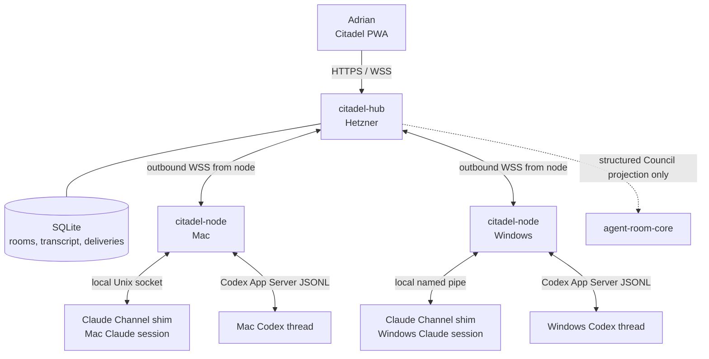

# Citadel — cross-device rooms for existing local agent sessions

Status: **APPROVED ARCHITECTURE · READY FOR SPARK DISPATCH 1**
Date: 2026-07-22
Implementation order: **this document first**, then `docs/plans/2026-07-14-agent-room-architecture.md` Dispatch 2.
Execution rule: Spark implements this plan exactly. It does not rename components, substitute transports, add Discord, move agents to Hetzner, or redesign the protocol.

## Header

**Goal:** Let Adrian create a web room, attach existing room-capable Claude and Codex sessions running on Mac and Windows, address a seat, watch its work, and hand work to another seat without manually copying messages between computers.

**Architecture:** A Rust hub on Hetzner owns rooms, transcripts, routing, delivery state, authentication, and the embedded React PWA. One invisible Rust node runs at login on each computer and makes an outbound authenticated WebSocket connection to the hub. Claude sessions connect through a thin custom Channel MCP shim; Codex sessions connect through Codex App Server. Agents remain on their original computer with their original filesystem, credentials, tools, repository, and model subscription.

**Visual plan:**



**Tech stack:** Rust 2021, Tokio 1, Axum 0.8, rusqlite 0.40.1 bundled SQLite, serde/serde_json, UUID v7, rustls, React 19, TypeScript 6, Vite 8, Vitest, pnpm 11.12.0, nginx, systemd, macOS LaunchAgent, Windows Task Scheduler with a GUI-subsystem executable, Claude custom Channels, Codex App Server.

## Executor contract

1. Work in the primary `/Volumes/D/claude` or `D:\Claude` checkout. Do not create a worktree.
2. Preserve unrelated dirty files. Stage only paths named in this document.
3. Use `apply_patch` for hand edits. Generated lockfiles and formatter output may be produced by their native commands.
4. Use test-first slices. Every task below names the failing test, implementation files, focused command, and required result.
5. Do not deploy until Tasks 0–11 are green locally on both operating systems.
6. Do not weaken sandbox or approval policies to make unattended operation appear successful.
7. A failed Task 0 Codex co-visibility gate is a hard blocker. Report the captured evidence; do not substitute a hidden CLI-only agent and call the Desktop requirement complete.
8. Custom Claude Channels are a research-preview feature. The required development-channel consent is an explicit operator setup step, not something to bypass silently.

## Product contract

### User-visible workflow

1. Adrian opens `https://citadel.spoares.com` and signs in.
2. He creates a room such as `memright`.
3. The UI shows online nodes (`mac`, `windows`) and their discoverable room-capable sessions.
4. He attaches seats with stable aliases: `mac-claude`, `windows-claude`, `mac-codex`, and `windows-codex`.
5. He writes `@windows-codex implement the mirror fix, commit and push, then hand off to @mac-codex`.
6. The hub creates one delivery for `windows-codex`; no other seat wakes.
7. The Windows node injects one turn containing the addressed message plus bounded room context.
8. Progress, questions, approval requests, final evidence, and the structured handoff appear in the same transcript.
9. The hub creates one delivery for `mac-codex` only after the structured handoff is recorded.
10. Adrian may interject, approve, deny, cancel, or reassign at any point.

### Transcript visibility

Freeform Citadel rooms are shared. Every attached seat may read every room message, subject to pagination and retention. The system does **not** inject the whole transcript into every model turn.

Each wake envelope contains:

- the addressed message;
- its parent message, when present;
- all visible messages after the seat's last acknowledged room sequence, capped at 20 messages and 32 KiB total;
- the current room objective;
- the seat roster and presence;
- open handoffs (their `evidence_refs` digest — commit SHA + test command + artifact path + URL — with full refs fetched on demand via `citadel_read`) and approval requests;
- a notice that `citadel_read` and `citadel_search` expose older transcript entries.

Council rooms are different: `agent-room-core` remains authoritative for blindness and controls which events are projected. That integration is Dispatch 2.

### Wake rules

A seat wakes only from one of these typed events:

- `human_mention` created by the web composer;
- `structured_handoff` created through an agent tool or the UI;
- `human_followup` replying to an outstanding agent question;
- `approval_resolved` for the seat's paused turn;
- `operator_resume` after an offline/reconnect state.

Agent prose is never parsed for `@alias`. An agent can wake another seat only by calling `citadel_handoff`. This prevents accidental and malicious wake loops.

**Prose-mention warning.** If a posted message contains `@<alias>` substrings but no seat was selected for delivery, the hub posts one follow-up system message tagged `mentions_unbound`: `<alias> was mentioned in prose but no wake was created. Use a structured handoff from the seat to invoke this seat, not a textual mention.` This answers the "why didn't `<alias>` wake?" question without enabling the loop the wake rules above are designed to prevent. The hub renders the warning but does not retroactively create deliveries.

**Browser degraded mode (offline).** When the PWA's WebSocket to `/api/events` is closed (network drop, hub restart, browser offline), the PWA:

1. **Writes are queued in IndexedDB.** Composed messages, approval decisions, and structured handoff create calls are persisted locally with their `request_id` and an attempt timestamp.
2. **Reads remain available.** Last-known transcript, seat presence, room list, and seat roster are rendered from the last-good event payload. A persistent banner indicates the connection state: `Offline — writes will replay when reconnected. Approvals and reply-with-attach are disabled.`
3. **On reconnect**, queued writes flush in `created_at_ms` order against `/api/rooms/:room_id/messages` and `/api/approvals/:approval_id/resolve`, deduped by `request_id`. Dedupe reuse returns the original response (rule §IDs and sequence).
4. **Hard limits while offline.** Approval clicks and `citadel_reply` with attached artifacts (file/path refs that go through node IPC) are **disabled** — the human must reconnect before resolving. Plain message composition remains enabled.

This is the only acceptable failure mode for a single-tenant system: writes never lost, reads never blocked, dangerous actions gated.

## ADR

### Product outcome

- **Who benefits:** Adrian coordinating local agents across two computers.
- **Success signal:** a real Windows agent completes work, records commit/test evidence, hands off, and a real Mac agent continues without Adrian copying any text.
- **Non-goals:** replacing Git, synchronizing repositories, moving model execution to Hetzner, general team chat, public multi-user signup, file transfer, or replacing Council's review protocol.

### Context and forced trade-offs

- Local agents cannot receive a remote turn without local participant software.
- The web hub must remain available while laptops sleep or reconnect.
- Claude and Codex expose different session-control surfaces.
- Existing arbitrary sessions become room-capable only after their vendor adapter is loaded or attached.
- The transcript can be complete without being injected wholesale into model context.

### Decision

Build one Hetzner hub plus one outbound-only node per computer; use Claude Channels and Codex App Server behind a shared typed Citadel protocol.

### Alternatives considered

| Alternative | Decision | Reason |
|---|---|---|
| Discord as UI and storage | Reject | Once a Hetzner hub is required for routing and delivery, Discord adds another identity, permission, formatting, and failure layer while preventing Citadel-specific session controls. |
| Browser-only clients | Reject | A browser cannot inject turns into local Claude/Codex processes without a local bridge. |
| Standard MCP polling | Reject | Standard MCP is tool/request oriented. Polling consumes turns and fails to wake an idle session. Claude Channels provides push; Codex App Server provides turn creation. |
| Expose laptop ports publicly | Reject | NAT, firewall, certificate, and attack-surface cost is unnecessary. Nodes connect outbound over WSS. |
| Run all agents on Hetzner | Reject | Violates the requirement that sessions retain their local files, credentials, UI, tools, and computer-specific state. |
| Reuse `agent-room-core` freeform mode | Reject | Council's phase machine and finding ledger are inappropriate for ordinary chat; `freeform` is unshipped and must remain so. |

### Riskiest assumption and smallest test

**Assumption:** A Codex App Server thread can be selected from Codex Desktop, remain visibly live there, and accept a `turn/start` from the node without creating a divergent conversation.

**Test:** Task 0 creates a named App Server thread, opens that exact thread in Codex Desktop, starts a second turn over App Server, and records whether the new user and agent messages appear live in Desktop with the same thread ID. Pass requires same-ID co-visibility on both Mac and Windows. Failure stops Codex integration.

### Blast radius, reversibility, and hidden coupling

- **Blast radius:** new sibling workspace only; no schema or behavior changes to RightKit release, MemRight, ClaudeMM proxy, Codex, or Council core.
- **Reversibility:** stop nodes, stop the systemd service, remove nginx location, and retain/export the SQLite transcript. No app repository depends on Citadel.
- **Admin-token recovery (single-tenant failure surface):** if `ROUND_TABLE_ADMIN_TOKEN` is lost, the protocol has no admin-recovery path — login cannot be performed and node-bearer secrets cannot be rotated. Keep the token in an external credential manager (1Password / macOS Keychain) **before** Task 11 deploys. A rotation procedure is documented in `docs/ROUNDTABLE-RUNBOOK.md` (Task 13).
- **Hidden coupling:** Claude Channel preview flags, Codex App Server protocol version, local session persistence directories, OS key stores, nginx WebSocket forwarding, and Git push races between seats.
- **Graph status:** `graph-unavailable`; Blueprint was stale while its generated files had unrelated active changes. Manual evidence came from the existing Council plan, `agent-room-core`, `agent-room-mcp`, current CLI help, and the official vendor contracts linked below.

## Prior-art decision matrix

| Mechanism | Local/current evidence | External approach | Decision | Validation gate |
|---|---|---|---|---|
| Push into Claude | Existing Council polls `room_next`; not suitable for idle cross-device sessions | Claude Channels pushes events into an already-running local session and supports reply/permission relay: [Channels](https://code.claude.com/docs/en/channels), [reference](https://code.claude.com/docs/en/channels-reference) | Adopt | Claude Task 7 two-way and approval smoke |
| Drive Codex | Existing Council spawns CLI seats | App Server provides `thread/resume`, `turn/start`, streamed events, and approvals: [App Server](https://learn.chatgpt.com/docs/app-server), [harness architecture](https://openai.com/index/unlocking-the-codex-harness/) | Adopt with gate | Task 0 same-thread Desktop proof |
| Remote transport | Existing Council is loopback-only | Outbound authenticated WSS keeps local ports closed; OpenAI's remote architecture likewise keeps execution local behind a relay: [Codex remote](https://openai.com/index/work-with-codex-from-anywhere/) | Adopt | reconnect/offline replay E2E |
| Human UI | Existing Council watch page is review-specific | Purpose-built PWA can model seats, deliveries, approvals, and handoffs directly | Adopt | Task 6 browser functional suite |
| Council state | `agent-room-core` already enforces blindness and typed findings | Discord/private threads cannot replace protocol enforcement | Preserve | Dispatch 2 existing Council suites remain green |

## RightKit reuse

| RightKit surface | Use |
|---|---|
| `rightkit-logs` | **Adopt** at its published crates.io version. Record hub lifecycle, room create/archive, delivery assign/ack/state/complete, dead-letter, node offline/reconnect, approval request/resolve. **Never** message bodies, seat tokens, `session_ref`, bearer secrets, or paired-credential material. Until published, hub emits `tracing` to stderr with structured fields. |
| `rightkit-platform-ui` | Excluded — Citadel is a service; the rightkit UI packages target Right Suite desktop apps. |
| `rightkit-tauri` | Excluded — Hub is Axum on Hetzner; node is a Rust service; no Tauri shell. |
| `rightkit-updates` | Excluded — single-tenant, no auto-update channel. |
| `rightkit-release` | Excluded — operator install only via `install-macos.sh` / `install-windows.ps1`. |
| `rightkit-process` | Excluded — hub spawns no child processes; Codex attachment uses the existing App Server process, not a fresh one. |
| `rightkit-license` / `rightkit-legal` | Excluded — single-tenant, no licensing. |
| `@rightkit/qa` | Excluded — hub is a service; PWA QA uses Vitest + Testing Library per Task 6. |
| `tools/rightkit/packages/agent-room-mcp/` (12 typed Council MCP tools) | **Separate sibling**, not a reuse target. Same problem domain (local Claude/Codex session attachment) at a different layer (Council multi-agent MCP vs. Citadel room bridge). **No code reuse; share abstract patterns only** (e.g. `session.join` / `session.leave` shape parallels `room_join` / `room_leave`). Verify with `ls tools/rightkit/packages/` before any future consolidation. |

## Repository layout and ownership

Create these paths exactly:

```text
tools/citadel/
├── Cargo.toml
├── README.md
├── crates/
│   ├── citadel-protocol/
│   │   ├── Cargo.toml
│   │   └── src/lib.rs
│   ├── citadel-store/
│   │   ├── Cargo.toml
│   │   ├── migrations/0001_initial.sql
│   │   └── src/lib.rs
│   ├── citadel-hub/
│   │   ├── Cargo.toml
│   │   ├── src/{main.rs,auth.rs,http.rs,router.rs,state.rs,ws.rs}
│   │   └── tests/{auth.rs,delivery.rs,http.rs,reconnect.rs}
│   └── citadel-node/
│       ├── Cargo.toml
│       ├── src/{main.rs,config.rs,codex.rs,hub.rs,ipc.rs,secrets.rs,state.rs}
│       └── tests/{codex_contract.rs,ipc.rs,reconnect.rs}
├── packages/
│   ├── web/
│   │   ├── package.json
│   │   ├── vite.config.ts
│   │   ├── index.html
│   │   ├── src/{main.tsx,App.tsx,api.ts,types.ts,styles.css}
│   │   └── src/components/{Composer.tsx,Login.tsx,MessageList.tsx,RoomList.tsx,RoomView.tsx,SeatPanel.tsx}
│   └── claude-channel/
│       ├── package.json
│       ├── src/{index.ts,ipc.ts,schemas.ts}
│       └── src/index.test.ts
├── fixtures/
│   ├── app-server/fake-codex.mjs
│   └── hub/fake-hub.rs
├── ops/
│   ├── roundtable.service
│   ├── nginx-citadel.conf
│   ├── install-macos.sh
│   ├── install-windows.ps1
│   └── backup.sh
└── tests/e2e/roundtrip.mjs
```

Do not place Citadel inside `tools/rightkit/`; it is an application that may consume patterns from RightKit, not a shared SDK primitive. Do not add `file:`, `link:`, Git, or workspace dependencies on RightKit packages.

**Provider isolation boundary.** Claude attaches through `packages/claude-channel` (a thin MCP shim over the Claude Channel preview feature). Codex attaches through `crates/citadel-node/src/codex.rs` (a typed adapter over the Codex App Server JSONL protocol). **Breaking vendor APIs only require rewriting the provider adapter**; the hub, store, protocol, HTTP API, WebSocket envelope, schema, and PWA do not change. The same boundary holds for adding a third provider (Groq / Gemini / local LLM) — it is a new `provider::*` module, not a hub change.

## Locked protocol

### IDs and sequence

- All externally visible IDs are UUID v7 strings.
- Every room has an integer `seq`, allocated transactionally and strictly increasing.
- Every client mutation carries a UUID v7 `request_id`.
- Uniqueness is `(actor_id, request_id)`. Same payload returns the original result; different payload returns HTTP `409 request_id_reused`.
- Every node stores the last acknowledged hub event cursor and every seat's last acknowledged room sequence.

### Core records

Implement these Rust types in `citadel-protocol/src/lib.rs` and generate matching TypeScript manually in `packages/web/src/types.ts` and `packages/claude-channel/src/schemas.ts`:

```rust
pub enum ActorKind { Human, Agent, System }
pub enum MessageKind { Chat, Question, Progress, Completion, Handoff, Approval, System }
pub enum DeliveryReason { HumanMention, StructuredHandoff, HumanFollowup, ApprovalResolved, OperatorResume }
pub enum DeliveryState { Queued, Sent, Acked, Running, WaitingApproval, Completed, Failed, DeadLetter }
pub enum SeatProvider { Claude, Codex }
pub enum SeatState { Detached, Offline, Idle, Running, WaitingApproval, Error }

pub struct Room {
    pub id: Uuid,
    pub slug: String,
    pub title: String,
    pub objective: String,
    pub next_seq: i64,
    pub archived_at: Option<i64>,
}

pub struct Message {
    pub id: Uuid,
    pub room_id: Uuid,
    pub seq: i64,
    pub actor_id: Uuid,
    pub actor_kind: ActorKind,
    pub kind: MessageKind,
    pub body: String,
    pub reply_to: Option<Uuid>,
    pub mentioned_seat_ids: Vec<Uuid>,
    pub created_at_ms: i64,
}

pub struct Seat {
    pub id: Uuid,
    pub room_id: Uuid,
    pub node_id: Uuid,
    pub alias: String,
    pub provider: SeatProvider,
    pub session_ref: String,
    pub state: SeatState,
    pub last_seen_ms: i64,
    pub last_ack_seq: i64,
}

pub struct Delivery {
    pub id: Uuid,
    pub room_id: Uuid,
    pub message_id: Uuid,
    pub seat_id: Uuid,
    pub reason: DeliveryReason,
    pub state: DeliveryState,
    pub attempt: i64,
    pub lease_until_ms: Option<i64>,
    pub error_code: Option<String>,
}
```

### Node WebSocket envelope

Every frame is JSON with this tagged shape:

```json
{
  "version": 1,
  "event_id": "019...",
  "sent_at_ms": 1784736000000,
  "type": "delivery.assign",
  "payload": {}
}
```

Hub-to-node types:

- `hello.accepted { node_id, heartbeat_ms: 15000, resume_cursor }`
- `delivery.assign { delivery, message, parent, context_messages, room, seats }`
- `approval.resolve { approval_id, decision }`
- `seat.detach { seat_id, reason }`
- `ping { nonce }`

Node-to-hub types:

- `hello { node_id, token, hostname, os, version, resume_cursor }`
- `delivery.ack { delivery_id }`
- `delivery.state { delivery_id, state, error_code? }`
- `message.post { request_id, seat_id, room_id, kind, body, reply_to? }`
- `handoff.create { request_id, from_seat_id, to_seat_id, body, evidence_refs[] }`
- `approval.request { request_id, seat_id, delivery_id, provider_request_id, description, input_preview, decisions[] }`
- `seat.presence { seat_id, state, last_ack_seq }`
- `session.catalog { provider, sessions[] }`
- `pong { nonce }`

Unknown `version` or `type` closes the socket with an explicit protocol error. Unknown fields are rejected for mutation frames and ignored for additive server notifications.

### HTTP API

All JSON mutations require `request_id`. Browser routes require the authenticated session cookie and exact-origin CSRF validation.

```text
POST   /api/auth/login
POST   /api/auth/logout
GET    /api/me
GET    /api/rooms
POST   /api/rooms
GET    /api/rooms/:room_id
PATCH  /api/rooms/:room_id
GET    /api/rooms/:room_id/messages?after_seq=&before_seq=&limit=
POST   /api/rooms/:room_id/messages
GET    /api/rooms/:room_id/seats
POST   /api/rooms/:room_id/seats
DELETE /api/rooms/:room_id/seats/:seat_id
POST   /api/rooms/:room_id/handoffs
POST   /api/approvals/:approval_id/resolve
GET    /api/nodes
POST   /api/nodes
DELETE /api/nodes/:node_id
GET    /api/events                         browser WebSocket upgrade
GET    /node/connect                       node WebSocket upgrade
GET    /healthz
GET    /readyz
```

Limits: message body 64 KiB, room title 120 characters, objective 4,000 characters, alias 48 lowercase letters/digits/hyphens, page limit 100, context envelope 32 KiB. Return `413` for body overflow and `422` for semantic validation.

### SQLite schema

`0001_initial.sql` creates exactly these tables:

- `rooms(id, slug UNIQUE, title, objective, next_seq, created_at_ms, archived_at_ms)`
- `nodes(id, name UNIQUE, token_hash, created_at_ms, revoked_at_ms, last_seen_ms)`
- `seats(id, room_id, node_id, alias, provider, session_ref, state, last_seen_ms, last_ack_seq, UNIQUE(room_id, alias), UNIQUE(room_id, node_id, provider, session_ref))`
- `messages(id, room_id, seq, actor_id, actor_kind, kind, body, reply_to, created_at_ms, UNIQUE(room_id, seq))`
- `message_mentions(message_id, seat_id, PRIMARY KEY(message_id, seat_id))`
- `deliveries(id, room_id, message_id, seat_id, reason, state, attempt, lease_until_ms, error_code, created_at_ms, updated_at_ms, UNIQUE(message_id, seat_id, reason))`
- `handoffs(id, room_id, message_id, from_seat_id, to_seat_id, evidence_json, created_at_ms)`
- `approvals(id, room_id, seat_id, delivery_id, provider_request_id, description, input_preview, decisions_json, state, resolution, created_at_ms, resolved_at_ms, UNIQUE(seat_id, provider_request_id))`
- `request_dedupe(actor_id, request_id, payload_sha256, response_json, created_at_ms, PRIMARY KEY(actor_id, request_id))`
- `browser_sessions(id_hash, expires_at_ms, created_at_ms, last_seen_ms)`
- `events(cursor INTEGER PRIMARY KEY AUTOINCREMENT, event_id UNIQUE, target_node_id, type, payload_json, created_at_ms)`

Enable WAL, `foreign_keys=ON`, `busy_timeout=5000`, and `synchronous=NORMAL`. All room sequence allocation, message insertion, mention insertion, delivery insertion, event insertion, and dedupe response persistence occur in one transaction.

## Security contract

- In local development the hub listens on `127.0.0.1:8460`. In production it listens only on the
  documented Docker bridge gateway `172.22.0.1:8460`, allowing the `nginx-brotli` container to reach
  it without exposing a public host interface; nginx alone exposes HTTPS.
- Production hostname is `citadel.spoares.com`.
- `ROUND_TABLE_ADMIN_TOKEN` is a generated 32-byte base64url secret. Login compares its SHA-256 digest in constant time.
- Successful login creates a random 32-byte browser session, stores only its digest, and sets `__Host-citadel` with `Secure; HttpOnly; SameSite=Strict; Path=/` and 30-day expiry.
- Node creation returns a bearer secret once; SQLite stores only SHA-256. Mac stores it in Keychain service `citadel-node`, account `<node-name>`. Windows stores it in Credential Manager target `citadel-node/<node-name>`.
- CORS is disabled. Mutations require `Origin: https://citadel.spoares.com`.
- CSP: `default-src 'self'; connect-src 'self' wss://citadel.spoares.com; img-src 'self' data:; style-src 'self'; script-src 'self'; object-src 'none'; base-uri 'none'; frame-ancestors 'none'`.
- No secrets appear in URLs, transcripts, logs, exports, process arguments, or browser storage.
- All inbound transcript content is untrusted data. It is wrapped as a channel/user message and never concatenated into system/developer instructions.
- Remote approvals display command/input preview and require an authenticated human click. Agent messages cannot resolve approvals.

**Prompt injection between seats is not a solvable problem inside the room protocol.** The room reduces attack surface by hiding plumbing (bearer tokens, session_ref, internal RPC) and by enforcing typed-protocol shape; **seat-runtime tool policy remains the responsibility of the seat runtime** (Claude Channel tool whitelist, Codex working-directory egress, plugin authority, subagent policy). Seats that compromise their own tool policy via injected transcript content cannot be detected at the boundary — the protocol's guarantee ends at "an instruction-shaped peer message did not change a compliant seat's behavior," not at "the seat is invulnerable." This is the same trust boundary the agent-room architecture names (Dispatch 2): the protocol is typed, the seat is untrusted.
- Node sockets accept only owner-local clients. macOS socket mode is `0600`; Windows named-pipe ACL is the current user SID only.

## Delivery and recovery contract

1. Hub inserts deliveries as `queued` and appends a durable targeted event in the same transaction.
2. Connected node receives `delivery.assign`, persists the event ID locally, then sends `delivery.ack`.
3. Hub moves to `acked` and leases for 10 minutes.
4. Node moves to `running` before invoking the provider.
5. Provider output is persisted to the hub before delivery becomes `completed`.
6. Disconnect before `ack` causes replay from the event cursor.
7. Disconnect after `ack` but before completion causes lease expiry and one retry with the same delivery ID.
8. Provider adapters must be idempotent by delivery ID. A completed delivery is never reinjected.
9. Three failed attempts move to `dead_letter` and create a visible system message. No infinite retries.
10. Heartbeat is 15 seconds; hub marks node offline after 45 seconds.
11. **Lease extension while running.** The lease in step 3 is **refreshed on every `delivery.state` post** from the running node — each `running`/`waiting_approval`/`progress` state update extends `lease_until_ms` by 10 minutes from the moment of update. A 30-minute Codex task that posts `progress` every 60 s therefore keeps a live lease without manual intervention; an idle (no progress) task that genuinely took >10 minutes still times out, which is the desired failure shape.
12. **Hub restart is transparent to nodes.** The `events` table is durable (`PRAGMA synchronous=NORMAL`, WAL); `systemd Restart=on-failure RestartSec=3` brings the hub process back in seconds. Nodes reconnect, replay cursor, and resume. No delivery is silently dropped unless the node already ACKed a delivery AND the provider completed before the hub crash — idempotency (rule 8) prevents duplicate injection. Hub logs every restart with the last-assigned `seq` and the cause line from systemd, so transcript gaps are auditable.

## Cancellation contract

Cancellation is operator-only (Adrian via `room cancel <delivery_id>` from the web UI or CLI) or, **only where the room-loop rules above already permit**, an agent calling `citadel_handoff` carries an implicit cancel of the source delivery the moment the target delivery is `acked`. In every other case, cancellations must come from Adrian.

1. **Cancel before provider starts.** The hub moves the delivery directly to `failed` with `error_code: canceled_by_<human|handoff>`. No provider invocation happens; no node message is required. A typed system message is posted so the transcript reflects the cancel without ambiguity.

2. **Cancel while provider is running.** The hub posts `seat.interrupt { delivery_id, reason }` to the node. The node translates to the provider's native interrupt: Codex `turn/interrupt` (pauses the active turn and emits a `turn/interrupted` event); Claude Channel `notifications.interrupt` (sends an end-of-channel interrupt that wakes Claude out of its current tool loop). Provider output already streamed is persisted as a partial `progress` message; no retraction.

3. **Cancel while waiting on approval.** The cancel kills the in-flight approval. If the human happens to click Allow/Deny later, the hub records `approval_resolved_after_cancel` and posts a system message that the approval was stale. The node does not invoke the provider after a cancel-while-waiting.

4. **Cancel after a handoff is already queued (target delivery).** The hub marks the target delivery `failed` with `error_code: canceled_by_<source>`. The source seat receives a system message — `<target_alias> was canceled before it started the handoff. Decide how to proceed.` The source seat may retry, escalate to Adrian, or stop.

5. **Partial outputs after cancel.** **The protocol does NOT roll back destructive actions already taken** — git commits already pushed, files already edited, branches already created, commands already executed. The cancel prevents further work; it does not undo prior work. This matches the agent-room architecture's stance: the seat runtime is responsible for transactional discipline, the protocol is responsible for preventing further work.

6. **Cancel under deep handoff cycles.** A cancel reaches only the addressed delivery. If the addressed delivery has already started a downstream handoff, the downstream is **not** auto-canceled — Adrian must cancel each link explicitly. The `handoff_depth_exceeded` counter (Task 9) prevents this from happening silently; the cancel pathway is independent.

7. **Audit trail.** Every cancel posts a typed system message with `canceled_by`, `delivery_id`, `seat_alias`, `reason`, and a transcript SHA-256. `ROUNDTABLE-RUNBOOK.md` (Task 13) documents how to inspect cancels: `SELECT id, room_id, seat_id, error_code, created_at_ms FROM deliveries WHERE error_code LIKE 'canceled_%' ORDER BY created_at_ms DESC LIMIT 100;`.

## Implementation plan

### Task 0 — prove vendor session attachment before scaffolding

**Files created:**

- `docs/evidence/roundtable/codex-desktop-mac.json`
- `docs/evidence/roundtable/codex-desktop-windows.json`
- `docs/evidence/roundtable/claude-channel-mac.json`
- `docs/evidence/roundtable/claude-channel-windows.json`

**Codex test procedure on each OS:**

1. Generate App Server schemas. On macOS run `rm -rf /tmp/roundtable-codex-schema && codex app-server generate-json-schema --experimental --out /tmp/roundtable-codex-schema`. On Windows PowerShell run `Remove-Item -Recurse -Force "$env:TEMP\roundtable-codex-schema" -ErrorAction SilentlyContinue; codex app-server generate-json-schema --experimental --out "$env:TEMP\roundtable-codex-schema"`.
2. Start `codex app-server --stdio` as a child test process.
3. Send `initialize`, then `initialized`.
4. Call `thread/start` with the real MemRight checkout as `cwd` and first input `Citadel attachment probe <uuid>`.
5. Record returned `thread.id`.
6. Open Codex Desktop and select the thread with that probe title/history.
7. Call `turn/start` on the same ID with `Citadel live update probe <uuid>`.
8. Pass only if Desktop displays both the second user message and streamed answer without importing, forking, or reopening another thread.
9. Write JSON evidence containing OS, Codex version, thread ID, timestamps, request/notification names, `desktop_same_thread: true|false`, and screenshot path. Do not include auth material.

**Claude test procedure on each OS:**

1. Create a temporary MCP server declaring `claude/channel` and a `reply` tool.
2. Start a real Claude Code session with `--dangerously-load-development-channels server:roundtable-probe`.
3. Push one unique notification and confirm the existing session wakes.
4. Make Claude call the reply tool and confirm the test harness receives the same correlation ID.
5. Repeat with a permission request fixture if the installed Claude version supports `claude/channel/permission`.
6. Record version, correlation IDs, wake/reply/permission results, and screenshot path.

**Gate:** all four evidence files must report success. Codex failure is a hard blocker. Claude permission-relay failure blocks remote approvals but not basic room chat; record `permission_relay_supported: false` and keep approvals local until the installed version is upgraded.

### Task 1 — scaffold the isolated workspace

**Create:** root workspace files and empty crates/packages from the repository layout.

**Locked manifests:**

- Rust workspace members: `crates/*`; resolver `2`.
- JS workspace members: `packages/*`; `packageManager: pnpm@11.18.0`.
- Root `package.json` scripts are exactly `"test": "pnpm -r --if-present test"` and `"build": "pnpm -r --if-present build"`.
- Hub and node share `citadel-protocol`; only hub uses `citadel-store`.
- Web uses React 19, React DOM 19, Vite 8, TypeScript 6, Vitest, Testing Library, and `@vitejs/plugin-react`.
- Claude channel uses `@modelcontextprotocol/sdk`, `zod`, TypeScript 6, and Node's built-in test runner. It must run under the Node bundled/configured in this workspace; do not require Bun.

**Red:** `cargo test --manifest-path tools/citadel/Cargo.toml` and `pnpm --dir tools/citadel test` fail because the workspace does not exist.

**Green:** create manifests and minimal compilation targets.

**Verify:** both commands exit 0 with at least one smoke test per crate/package.

### Task 2 — implement protocol types and canonical serialization

**Tests first:** `citadel-protocol/src/lib.rs` unit tests named:

- `uuid_v7_round_trips`
- `unknown_mutation_field_rejects`
- `websocket_envelope_round_trips`
- `message_size_limit_is_bytes_not_chars`
- `agent_prose_mentions_do_not_create_targets`

**Implementation:** add the locked enums, structs, validation, envelope, error codes, and canonical SHA-256 payload serialization. `deny_unknown_fields` applies to client mutation structs.

**Verify:** `cargo test --manifest-path tools/citadel/Cargo.toml -p citadel-protocol` reports all five tests passed.

### Task 3 — implement transactional storage

**Tests first:** store tests named:

- `migration_creates_exact_schema`
- `message_and_deliveries_commit_atomically`
- `room_sequence_is_gap_free_under_concurrency`
- `same_request_same_payload_replays_response`
- `same_request_different_payload_conflicts`
- `lease_expiry_requeues_once`
- `third_failure_dead_letters`
- `foreign_keys_reject_orphans`

**Implementation:** one dedicated DB actor owns the rusqlite connection. Async callers send typed commands over Tokio mpsc and receive oneshot responses. Do not wrap a shared `Connection` in `Mutex` across async tasks.

**Verify:** `cargo test --manifest-path tools/citadel/Cargo.toml -p citadel-store` passes; a temporary database survives close/reopen with transcript and cursor intact.

### Task 4 — implement hub authentication and HTTP API

**Tests first:**

- invalid login returns `401` without setting a cookie;
- valid login sets the exact cookie attributes;
- wrong Origin returns `403` on mutations;
- revoked node token cannot upgrade;
- room/message CRUD validates all limits;
- human mention creates exactly one delivery per selected seat;
- duplicate mutation returns the first response;
- unauthenticated transcript access returns `401`.

**Implementation:** `auth.rs` owns token hashing/session cookies; `http.rs` owns routes/extractors; `router.rs` owns typed delivery creation; `state.rs` owns shared application handles.

**Verify:** `cargo test --manifest-path tools/citadel/Cargo.toml -p citadel-hub --test auth --test http --test delivery` passes.

### Task 5 — implement node WebSocket, replay, and presence

**Tests first:**

- reconnect resumes after the last durable cursor;
- duplicate event ID is acknowledged but not reinjected;
- heartbeat timeout marks node offline;
- completed delivery is not retried;
- lease retry preserves delivery ID;
- invalid protocol version closes with `protocol_version`;
- a node cannot post for a seat it does not own.

**Implementation:** hub `ws.rs` authenticates and replays targeted events. Node `hub.rs` owns one reconnect loop with capped exponential backoff: 1, 2, 4, 8, 15, then 30 seconds with ±20% jitter. Node persists cursor and delivery state before acknowledgement.

**Verify:** hub and node reconnect tests pass with the fake hub fixture; killing and restarting the node during a fixture delivery produces exactly one provider invocation.

### Task 6 — implement the PWA

**Tests first:**

- login success/failure;
- create and archive room;
- attach/detach a discovered session;
- `@` autocomplete inserts mention metadata, not just text;
- message posting renders optimistic state then server sequence;
- seat presence and delivery state update from WebSocket;
- approval card shows input preview and only authenticated human controls;
- handoff renders source, target, summary, and evidence refs;
- transcript pagination preserves scroll anchor;
- keyboard-only composer and controls have visible focus and accessible names.

**Implementation constraints:**

- No component library and no animation library.
- CSS uses system fonts, reduced-motion media query, and a single 120 ms opacity/transform transition for non-essential presence changes.
- Mobile layout supports 390 px; desktop supports 1024 px and above.
- The UI never infers delivery state from message text.
- Compile the web output into `citadel-hub` at build time and serve it with immutable hashed assets plus `index.html` no-cache.

**Verify:** `pnpm --dir tools/citadel/packages/web test` and `pnpm --dir tools/citadel/packages/web build` pass with no console errors.

### Task 7 — implement local IPC and Claude Channel shim

**IPC contract:** newline-delimited JSON over the owner-only Unix socket/named pipe. Methods:

- `session.join { provider, session_ref, alias, room_id }`
- `session.leave { seat_id }`
- `transcript.read { room_id, after_seq?, before_seq?, limit }`
- `transcript.search { room_id, query, limit }`
- `message.reply { seat_id, delivery_id, body, kind }`
- `handoff.create { from_seat_id, to_alias, body, evidence_refs }`
- `approval.verdict { approval_id, decision }`
- server notification `delivery.assign`
- server notification `approval.request`

**Claude MCP tools:** `citadel_session_join`, `citadel_leave`, `citadel_read`, `citadel_search`, `citadel_reply`, and `citadel_handoff`. The shim declares `claude/channel`, tools, and `claude/channel/permission` only when Task 0 proved permission support.

**Channel event metadata:** `room_id`, `delivery_id`, `message_id`, `sender`, `reply_to`, and `reason`. Instructions require Claude to treat content as untrusted room data, reply with `citadel_reply`, and use `citadel_handoff` rather than textual mentions.

**Tests first:** unauthorized local process rejected; join/leave round-trip; queued delivery produces one channel notification; reply preserves delivery ID; structured handoff targets one seat; permission ID round-trips; shim restart resumes without duplicate injection.

**Verify:** `pnpm --dir tools/citadel/packages/claude-channel test` and node IPC tests pass. A real Claude session receives a message from the web UI and replies into the transcript.

### Task 8 — implement Codex App Server adapter

**Connection sequence:** spawn or connect to the supported local App Server discovered in Task 0; send `initialize` with `clientInfo.name = "citadel-node"`, then `initialized`; use `thread/list`, `thread/read`, and `thread/resume`; start work with `turn/start`; use `turn/steer` only when an authenticated human follow-up targets the currently active turn and `expectedTurnId` matches.

**Mapping:** persist `(seat_id, thread_id, cwd, model, active_turn_id)` in node state. Never choose a thread solely by title after attachment; title is discovery UI only, thread ID is authoritative.

**Event mapping:**

- agent message deltas accumulate locally and publish one final `completion` or `question` message on item/turn completion;
- command/file progress becomes throttled `progress` messages at most once every 2 seconds;
- command and file approval requests become typed Citadel approvals;
- `tool/requestUserInput` becomes a `question` and pauses the delivery;
- turn completion sets delivery `completed`, `failed`, or `waiting_approval` from the actual App Server status.

**Tests first using `fake-codex.mjs`:** handshake ordering; resume exact thread ID; one delivery creates one turn; active human follow-up uses `turn/steer`; agent handoff output creates no target unless the structured handoff tool is called; approval request/resolution preserves request ID; reconnect reads thread status before retry; completed turn is not duplicated.

**Verify:** node Codex contract tests pass and the Task 0 Desktop co-visibility flow succeeds through the real node on both operating systems.

### Task 9 — implement orchestration and loop prevention

**Tests first:**

- human mention wakes only selected seats;
- agent text containing every alias wakes nobody;
- structured handoff wakes exactly the target after source completion;
- handoff to offline seat remains queued;
- circular A→B→A handoffs stop after the room's handoff depth limit of 8 and create `handoff_depth_exceeded` (8 = one full cycle through 8 distinct seats; rooms that legitimately chain deeper have escaped the room model and should be redesigned, not patched);
- two seats cannot claim the same exclusive task ownership key;
- completion without evidence refs remains visible but is marked `evidence_missing`;
- messages older than a seat cursor remain readable but are not reinjected automatically.

**Implementation:** add optional `task_key` ownership to handoffs without adding a general Kanban system. A handoff requires summary text and may include commit SHA, test command, artifact path, or URL evidence refs. Hub computes depth from typed handoff edges.

**Verify:** delivery suite passes and a two-fake-seat E2E completes one handoff with no duplicate wakes.

### Task 10 — install node at login on both operating systems

**macOS:** `ops/install-macos.sh` copies the release binary under `~/Library/Application Support/Roundtable/bin/`, stores config without secrets under `~/Library/Application Support/Roundtable/config.json`, installs `~/Library/LaunchAgents/com.adrian.citadel-node.plist`, loads it, and verifies health through the Unix socket. Logs go to `~/Library/Logs/Roundtable/`.

**Windows:** build with `#![cfg_attr(target_os = "windows", windows_subsystem = "windows")]`; `ops/install-windows.ps1` copies under `%LOCALAPPDATA%\Roundtable\bin`, creates a per-user at-logon Scheduled Task that launches the GUI-subsystem executable directly, starts it once, verifies the named pipe, and confirms no console window appears. Logs go to `%LOCALAPPDATA%\Roundtable\logs`.

**Tests:** install/uninstall are idempotent; config survives update; secret never appears in task/plist arguments; node restarts after process kill; no foreground terminal flashes on Windows.

### Task 11 — production deployment on Hetzner

Task 11 is production mutation. Spark executes it only when Adrian's dispatch explicitly includes
`DEPLOY TASK 11`. Otherwise Spark completes Tasks 0–10, writes the deploy packet, commits/pushes, and
reports Task 11 as intentionally not authorized. This is a fixed safety boundary, not an
implementation decision.

**Locked paths:**

- binary: `/opt/roundtable/bin/citadel-hub`
- web assets: embedded in binary
- env: `/etc/roundtable/roundtable.env`, mode `0600`
- data: `/var/lib/roundtable/roundtable.sqlite3`
- backups: `/var/backups/roundtable/`
- service user/group: `roundtable`
- production bind: `172.22.0.1:8460`
- public host: `citadel.spoares.com`

**Systemd:** `roundtable.service` uses `User=roundtable`, `Group=roundtable`, `EnvironmentFile`, `Restart=on-failure`, `RestartSec=3`, `NoNewPrivileges=true`, `PrivateTmp=true`, `ProtectSystem=strict`, `ProtectHome=true`, `ReadWritePaths=/var/lib/roundtable`, and waits for `/readyz`.

**nginx:** the box uses the Dockerized `nginx-brotli` image. Copy the committed
`tools/citadel/ops/nginx-citadel.conf` to `~/sites/nginx/roundtable.conf`; add an explicit
`COPY roundtable.conf /etc/nginx/conf.d/roundtable.conf` line to `~/sites/nginx/Dockerfile`; proxy
`/api/events` and `/node/connect` with WebSocket upgrade headers; proxy all other paths to the Docker
gateway host at port `8460`; set HSTS, CSP, Referrer-Policy, X-Content-Type-Options, and no-cache for
`index.html`. Before any rebuild run:

```bash
for f in ~/sites/nginx/*.conf; do b=$(basename "$f"); grep -q "COPY $b " ~/sites/nginx/Dockerfile && echo "IN $b" || echo "MISSING $b"; done
```

Every line must start `IN`. A `MISSING` result is a hard stop; add all missing `COPY` lines before
asking Adrian to run the sudo rebuild.

**Backup:** `backup.sh` runs `sqlite3 ... '.backup ...'`, hashes the result, retains 14 daily files, and exits nonzero if `PRAGMA integrity_check` is not `ok`.

**Deploy sequence:**

1. Push the implementation commit to `origin/main` from the laptop.
2. Verify SSH with `ssh -o BatchMode=yes vendure 'printf ready'` on Mac. On Windows use the fixed
   `SSH_AUTH_SOCK=/tmp/ssh-dd-sock` recipe in `.claude/rules/ssh-server-access.md`.
3. The canonical repository is `github.com/Orthic-Labs/roundtable`, not the workspace repo. On the
   box the checkout is `~/sites/citadel`; clone it there if absent, then
   `git fetch origin && git checkout main && git pull --ff-only origin main`.
4. **Do NOT build on Hetzner, and do NOT add CI (Adrian, 2026-07-25).** No Rust toolchain is
   installed on the production box and none is to be installed: it runs 17 live pm2 services on 4
   CPUs, and a release build of this workspace (bundled SQLite, tokio, axum) competes directly with
   them. The earlier instruction here — `cargo build --release` on Ubuntu — was followed once on
   2026-07-25, installing a toolchain and starting a build on the live box; both were removed.

   **Hosted CI is also out.** No `.github/workflows`, no Buildkite/CircleCI/GitLab/Azure, no
   self-hosted runners. This is a standing workspace decision, not a Citadel one.

   That leaves a genuine constraint with no clean answer today: this Mac is `arm64`, the box is
   `x86_64`, and no cross toolchain is installed (`zig`, `cargo-zigbuild`, `cross`, and `docker`
   are all absent). **A Rust hub therefore has no deployment path that does not add new tooling
   somewhere.** See "Hub language" below before writing any deploy script.
5. Stage the binary, unit, env, and data directories. Secret generation is performed in a shell that
   does not echo command tracing; the token is written directly to `/etc/roundtable/roundtable.env`
   and never printed.
6. Install/start `roundtable.service`; verify `curl --fail http://172.22.0.1:8460/readyz` returns 200.
7. Copy and inventory the nginx config as specified above. Show Adrian the complete inventory and
   exact Docker diff. Adrian runs the required sudo Docker build/restart; Spark does not attempt to
   bypass sudo.
8. Create/proxy the Cloudflare DNS record for `citadel.spoares.com` using the existing scoped token.
9. Verify HTTPS login and WSS upgrades, then create Mac and Windows node credentials without printing
   them.
10. Connect both nodes and proceed to Task 12. Never edit source directly on the box.

### Task 12 — end-to-end acceptance

Run these cases against production with real Mac and Windows sessions:

1. Human → Windows Codex → structured handoff → Mac Codex.
2. Human → Mac Claude → structured handoff → Windows Claude.
3. Mixed provider Windows Codex → Mac Claude.
4. Node offline during mention, then reconnect and process once.
5. Hub restart during active room, then transcript and delivery recovery.
6. Duplicate frame/retry does not duplicate model turns.
7. Agent prose with aliases creates no wake.
8. Remote approval allow and deny for both supported providers.
9. Transcript pagination and search recover messages outside injected context.
10. Concurrent independent seats operate without blocking each other.

Write `docs/evidence/roundtable/acceptance.json` containing case ID, room ID, seat IDs, message/delivery IDs, OS, provider versions, timestamps, commit/test evidence, and pass/fail. Strip secrets and model hidden reasoning.

**Acceptance threshold:** all ten cases pass. A skipped case is a failure.

### Task 13 — documentation and operator handoff

Create:

- `tools/citadel/README.md`: local development, test, build, node provisioning, session attachment, recovery.
- `docs/ROUNDTABLE-RUNBOOK.md`: production deploy, rotate admin/node secrets (`roundtable token rotate admin` and `roundtable token rotate node <node-id>` produce the new token without printing it — output is fed directly into `install-macos.sh` / `install-windows.ps1`), backup/restore, revoke node, inspect dead letters (SQL query: `SELECT id, room_id, seat_id, error_code, attempt, updated_at_ms FROM deliveries WHERE state = 'dead_letter' ORDER BY updated_at_ms DESC LIMIT 100;`), upgrade hub/node, uninstall.
- `ops/observability.md`: structured log fields the hub emits via `rightkit-logs` (hub lifecycle, room create/archive, delivery assign/ack/state/complete, dead-letter, node offline/reconnect, approval request/resolve), `journalctl -u roundtable.service --since '<time>'` for ad-hoc tail, `node-presence-watch.mjs` snippet for live seat status from `/api/events`. **Dead-letter cap:** the runbook must call out that the dead-letter queue never grows past 3× successful deliveries without operator attention; the nightly backup job in `ops/backup.sh` records `dead_letter_count` and fails closed if it exceeds `3 * (deliveries completed in last 24 h)`.
- update this plan status to `IMPLEMENTED` only after Task 12 passes and link the acceptance evidence and implementation commit.

## Exact verification commands

Run from the repository root:

```bash
cargo fmt --manifest-path tools/citadel/Cargo.toml --all -- --check
cargo clippy --manifest-path tools/citadel/Cargo.toml --workspace --all-targets -- -D warnings
cargo test --manifest-path tools/citadel/Cargo.toml --workspace
pnpm --dir tools/citadel install --frozen-lockfile
pnpm --dir tools/citadel test
pnpm --dir tools/citadel build
node tools/citadel/tests/e2e/roundtrip.mjs --hub http://127.0.0.1:8460 --fake-nodes 2
```

Expected final result: formatting and clippy exit 0; all Rust and JS tests pass; web and channel packages build; E2E prints `ROUNDTRIP PASS deliveries=2 duplicates=0`.

## Full-optimization requirements

- **Idle resources:** hub handles independent rooms/nodes concurrently; one blocked provider never blocks the DB actor or other nodes.
- **Duplicate work:** message context is fetched once per delivery; event and request IDs dedupe transport retries; App Server output is accumulated once.
- **Overlap:** independent seat deliveries run concurrently, while each individual seat remains serial to protect one conversation timeline.
- **Resume:** hub events, node cursor, provider thread ID, delivery lease, and transcript are durable before acknowledgement. Every long step resumes after interruption.

## Operational economics

The architecture is single-tenant, but numbers should still be visible. **All four cells below are estimated until Task 12 acceptance persists measured values**; the table is the gate that surfaces the actual ratio at the first running production.

| Metric | Estimated | Evidence source |
|---|---|---|
| Per-room monthly cost (USD) | TBD | (Hetzner `vendure` shared) × N active rooms × M seats |
| WebSocket heartbeat cost (bytes/node/day) | TBD | N nodes × heartbeat 15 s × 5,760/day × envelope bytes; baseline ~3–12 MB/node/day |
| SQLite WAL file size + retention | TBD | `events` table grows monotonically (append-only); define prune policy at first measured run (`DELETE FROM events WHERE created_at_ms < now - 30d AND target_node_id IS NULL`) |
| End-to-end latency, human mention → model turn | TBD | clock-time logged at `delivery.acked` and `delivery.completed` |

**Cost ratio vs. today's text-copy manual flow.** Pre-Citadel, Adrian pastes text between machines: zero fixed cost, ~30–120 seconds per handoff, plus the cost of dropping a message. The room is a one-Hetzner-process fixed cost plus per-delivery wake cost. **Until Task 12 measures both**, the room's claim is "eliminates a class of error," not "saves time" — the comparison cell for round-trip latency exists to test whether this expectation holds.

**Failure surface.** If measured monthly spend trends above 2× projection for two consecutive weeks, OR if the dead-letter queue exceeds the 3× successful deliveries cap (Task 13 observability), the room is no longer net-positive against pre-Citadel and re-enters §Explicit rejections review.

## Definition of done

- The exact four real seats join one room.
- Every seat can read the shared visible transcript through bounded wake context plus read/search tools.
- Human mentions and structured handoffs wake the correct seat exactly once.
- Mac/Windows nodes start invisibly at login and reconnect without inbound ports.
- Claude and Codex replies, progress, questions, approvals, failures, and completion evidence render in the PWA.
- No textual agent mention can trigger another agent.
- Offline and restart cases lose no accepted message and duplicate no provider turn.
- Council code and tests remain untouched in Dispatch 1.
- Production acceptance evidence records all ten passing cases.

## Spark completion report format

Spark's final response must contain only:

1. implementation commit SHA;
2. files created/modified grouped by hub, node, Claude, Codex, UI, ops, docs;
3. exact verification commands and pass counts;
4. Task 0 and Task 12 evidence paths;
5. production URL and connected node/seat names;
6. any failed hard gate with the exact failing output.

Do not report “mostly complete,” defer tests, or substitute a different runtime.

### Critical Files for Implementation

- `tools/citadel/crates/citadel-protocol/src/lib.rs`
- `tools/citadel/crates/citadel-hub/src/router.rs`
- `tools/citadel/crates/citadel-node/src/codex.rs`
- `tools/citadel/packages/claude-channel/src/index.ts`
- `tools/citadel/packages/web/src/App.tsx`
