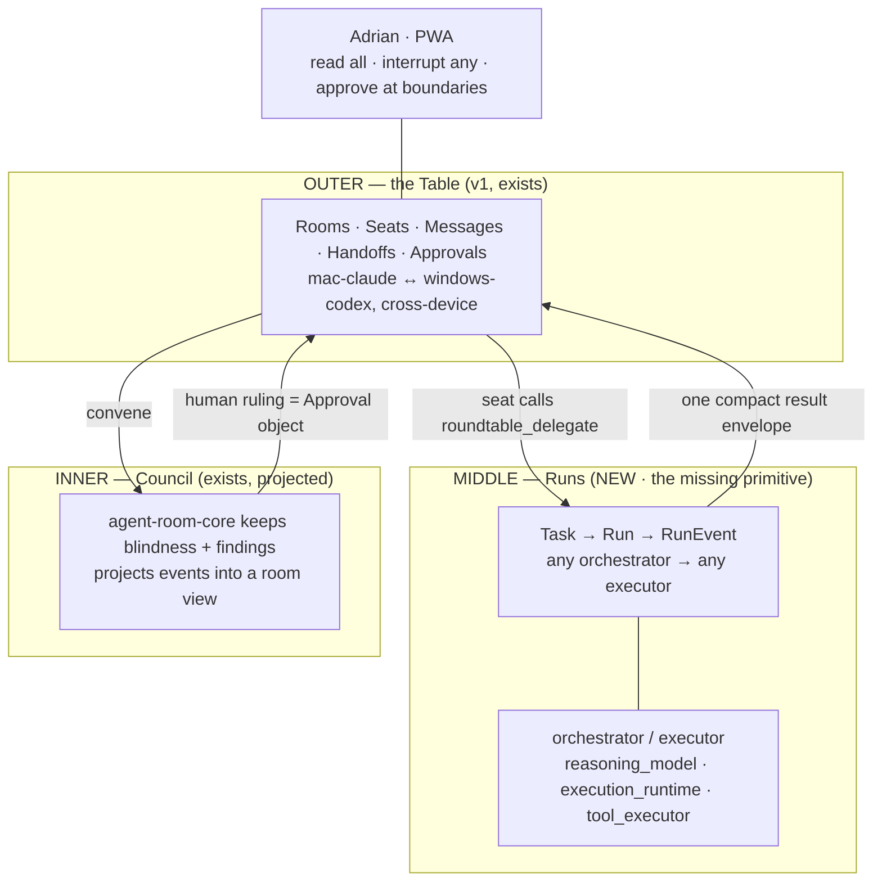

# Citadel — Three-Ring Synthesis

This document reconciles Sol's 2026-07-25 "Final Peer-Capable Multi-Runtime Architecture"
against the actual repository state and against Adrian's three stated requirements.

## Ground truth (verified 2026-07-25, this checkout)

| Claim | Reality on `main` |
|---|---|
| README: hub has "auth/origin guard + HTTP + ws + replay, 24 tests" | `crates/roundtable-hub/src/main.rs` is **18 lines**: `/healthz`, `/readyz` |
| Whole Rust workspace | **1,911 lines** across 4 crates |
| Claude MCP shim tools | **7**: `join, leave, read, search, reply, handoff, approval` — no delegate, no spawn, no create_room |
| v1 protocol domain | `Room, Message, Seat, Delivery, Envelope<T>` + `MessageKind/DeliveryState/SeatProvider` enums |
| README "Status" section | Tests pass "in the agent worktree that produced each slice" — i.e. **not on main** |

Sol's §1.4 (status reconciliation required) is correct and is the single most valuable
page in his document. Nothing below should start before it is done.

## Adrian's three requirements

1. **A table.** Connect two agents — Claude↔Codex, or Mac↔Windows — in a room he controls
   remotely while they execute on their own devices. *(v1 already targets this.)*
2. **Visibility into delegation.** When any orchestrator shells out to any executor — Claude→CCX,
   Codex→CDX, Claude→Codex, Codex→Claude — Adrian currently sees nothing.
   *(Not representable in v1 at all.)*
3. **Council at the table.** The Council skill sits in an inner room he can watch, with the
   human-in-the-loop ruling gate intact. *(Exists as a separate system, `agent-room-core`.)*

Requirement 2 is the live pain and the only one with no partial answer today.

## Verdict on Sol's document

**Diagnosis correct, prescription ~5× oversized.**

Correct and load-bearing: `Message + Delivery` cannot represent delegated work. The fix is
**Task / Run / RunEvent as first-class records, distinct from the transcript.** That single
change satisfies all three requirements. Everything else in the document is scaffolding
around it.

### Four objections

1. **Sol conflates two different symmetries; one is needed, one is not.**
   - **Role symmetry — KEEP.** Either side can orchestrate. Claude→Codex and Codex→Claude are
     the same edge with the labels swapped. This is real and must be in the model.
   - **Authorization symmetry — CUT.** An 18-verb capability algebra with grants, denials, and
     a provider-neutral policy engine is an authorization *system*. There is one operator and
     no second tenant to authorize against.

   Role symmetry costs **two columns** on the run record — `orchestrator_participant` and
   `executor_participant`, neither provider-typed. Sol spends three tables and eighteen verbs
   to express what those two columns already say.

2. **It defers the actual ask to last.** Delegation visibility is Stage 6, behind protocol v2,
   store v2, transport, Codex App Server, and Claude dual-runtime. It is also the cheapest
   item on the list, because there are only ever **two executor shapes** (see below) and the
   Claude-shaped one already has a hook layer that can emit run events with no protocol v2.

3. **27 tables and 11 stages against 1,911 lines that have never run end-to-end.** This is
   the failure mode CLAUDE.md §10 names explicitly — elaborate scaffolding nobody uses.
   Protocol v2 as a rewrite discards the v1 scaffold before it has proved anything.

4. **Not proofread.** Two consecutive sections numbered 3.2 (lines 299–300); a broken mermaid
   node at line 441 (`WX["Codex managed run<br/>App Server")]`) that will not render. Nobody
   rendered a document labelled FINAL TARGET ARCHITECTURE.

## The target shape — one table, three rings



### Outer ring — the Table

What v1 already is. Rooms, seats, human-composed messages, typed handoffs, approvals,
cross-device and cross-vendor, credentials and repositories staying local. Do not redesign
it. Finish it.

### Middle ring — Runs

The one new primitive. A seat calls `roundtable_delegate` and receives a durable task ID
immediately. The run streams normalized events — model deltas, tool calls, commands, file
changes, diffs, tests, usage — into a **run pane**, never into the room transcript. The room
sees one line going in and one compact result envelope coming out.

#### Orchestrator and executor, not provider names

A run records two roles, and **neither is provider-typed**:

```text
orchestrator_participant  — the seat that requested the work
executor_participant      — the seat/session that performed it
```

Claude→Codex and Codex→Claude are the same edge with the labels swapped. Any seat can occupy
either role on any given run. This is the whole of the symmetry that matters; it needs no
capability algebra.

#### There are only two executor shapes — ever

ClaudeCodeX makes this concrete. `ccx` is Claude Code with four model-slot env vars repointed;
`cdx` is Codex CLI with `CODEX_HOME=~/.codex-proxy`. GLM, Qwen, MiniMax, DeepSeek and Kimi all
arrive through one of those two doors. **The model is a config value inside a harness, not an
integration.**

Consequence for Citadel: it never writes a "MiniMax adapter" or a "Qwen adapter." It writes
**two executor adapters** — Claude-Code-shaped (hooks, Channels, Agent SDK) and Codex-shaped
(App Server, `exec --json`) — and the model name is a *field on the run record*. Sol's §8.5
per-provider conformance suite collapses to a per-harness one.

#### Attribution

Three fields kept separate, exactly as Sol specifies:
`reasoning_model` / `execution_runtime` / `tool_executor`.

Sol treats the split as an edge case for proxied calls. With CCX it is the **normal** case for
every third-party model in the studio: `reasoning_model=MiniMax-M3`,
`execution_runtime=ccx`, `tool_executor=claude-code`. The UI must show the model that reasoned
and the harness that touched the filesystem, always, not just when something looks unusual.

#### Grade

Each run carries an **observability grade** (`full` / `standard` / `partial` / `opaque`)
displayed in the UI, so the interface never implies more visibility than the adapter can
actually emit.

### Inner ring — Council

Keep `agent-room-core` exactly as it is. Its blindness state machine and finding ledger are
the valuable part. Council runs as a workflow profile, projects phase / proposal / critique /
dissent events into a room view, and its human ruling gate becomes a Citadel Approval
object. That is the entire integration.

Explicitly reject Sol's §10.3 "converge persistence once parity is proven" — an open-ended
rewrite of a working state machine that will never pay for itself.

## Keep from Sol

- Stage 0 repository reconciliation (do this regardless).
- Task / Run / RunEvent separation from Message / Delivery.
- Observability-grade ladder, surfaced in the UI.
- Three-field model/runtime/executor attribution.
- Compact result envelope + worker context isolation.
- Node-side reconciliation states instead of blind retry after disconnect.
- Never inject the full transcript; bounded context bundles.
- Rust + SQLite. No Temporal, NATS, Postgres, or Kubernetes.
- The approval-risk ladder (observe / reversible / consequential / destructive / external).
- Isolated worktree + branch per write-capable task.

## Cut or defer

| Sol proposes | Instead |
|---|---|
| 18-verb capability algebra, `participants` + `participant_capabilities` + `room_memberships` | Two role columns on the run record. Human owns room lifecycle. |
| Per-provider runtime adapters + conformance suite (§8.5) | **Two** executor adapters — Claude-Code-shaped and Codex-shaped. Model is a field. |
| 27 tables | ~6 added to v1: `tasks`, `runs`, `run_events`, `artifacts`, `host_capabilities`, `task_assignments` |
| Protocol v2 rewrite | Additive extension of v1 `Envelope<T>` / `MessageKind` / `DeliveryState` |
| OpenTelemetry + Langfuse + Phoenix | The event log *is* the inspector for one operator. Exporters when there is a second. |
| ACP + A2A gateways | Not now. |
| Workflow DAG engine, deterministic pipeline profiles | Not until manual delegation demonstrably works. |
| 11 stages | 5 phases, below. |

## Sequence — inverted from Sol's

**Phase 0 — reconcile.** Sol's Stage 0. Merge or discard the worktree slices, run every
claimed test from a clean `main`, make the README true, mark unimplemented architecture as
planned. No other work starts first.

**Phase 1 — instrument one orchestrator→executor edge, provider-neutral.** Adrian's live pain,
and it needs no protocol v2. Define the run-event schema once at the delegation boundary, then
emit from the Claude-Code-shaped executor via the existing hook layer (`ccx` is Claude Code, so
the hooks are already there) into a run pane. The schema must not name a provider anywhere —
model, harness, and executor are all fields. Delivers requirement 2 before the Rust work matures.

**Phase 2 — durable runs.** Add the Task / Run / RunEvent tables and `roundtable_delegate`,
so runs survive restarts and any seat can start one. Phase 1's hook-emitted events become one
adapter among several.

**Phase 3 — the second executor shape + the two-agent table.** Finish the Codex App Server
adapter (request correlation, event stream consumption, approvals, interrupt, reconciliation)
and the Claude Channel two-way path. This is also what makes `cdx` visible, since Codex-shaped
executors and Codex *seats* are the same adapter. Delivers requirement 1.

**Phase 4 — Council projection.** Wire `agent-room-core` as a workflow profile projecting into
a room view; human ruling becomes an Approval. Delivers requirement 3.

Mapping to Sol's stages: his 0 → Phase 0; his **6 (API runtime) moves from ninth position to
first**, which is the single biggest reordering; his 4 and 5 → Phase 3; his 9 → Phase 4; his 1,
2, 3, 7, 8 and 10 fold into Phases 2–3 or are cut per the table above.

## Open decision for Adrian

Phase 1 can ship as a hook-based shim that is later replaced by the Phase 2 adapter, or it
can wait for Phase 2 and be built once. The shim gets visibility in front of you sooner at
the cost of code that is thrown away.

**Recommendation: build the shim.** The run-event schema it forces you to design is the same
schema Phase 2 needs, so the discarded part is only the transport. The two-executor-shape
finding strengthens this: because the schema is provider-neutral by construction, the shim
cannot paint you into a MiniMax-shaped or Claude-shaped corner the way a provider-specific
prototype would.

## Retired terminology (2026-07-25)

`mm` / `claudemm` / `tools/minimax-proxy` are gone; ClaudeCodeX (`ccx` / `cdx`) replaced them
on the same `:8801` port. Do not reintroduce provider names into the Citadel domain model —
the naming discipline is the architecture. Note that `[no-mm]` in the hook layer is unrelated:
there `MM` means *machine-minimal*, not MiniMax.
