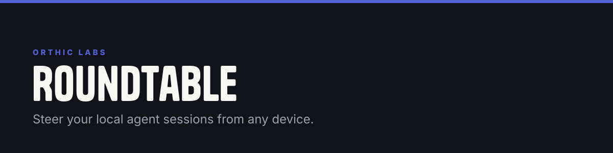

**Roundtable lets you steer live local Codex and Claude coding sessions from another device without moving provider API keys or full hidden session state into a cloud agent service.**


## What it is

Roundtable turns agent sessions already running on your machines into authenticated rooms. Send a message from phone, laptop, or browser; the local node holding the real session delivers it to Codex or Claude, then posts the reply back to the shared room.

The hub coordinates messages. Your machine still runs the agent.

## How it works

```text
phone / laptop / browser
          │ HTTPS + WebSocket
          ▼
   Roundtable hub + SQLite
          │ authenticated node delivery
          ▼
 local node on coding machine
          ├── Codex app-server
          └── Claude MCP channel
```

Core concepts:

- **Room:** shared transcript around one piece of work.
- **Seat:** named agent identity inside a room, such as `mac-codex`.
- **Node:** local daemon attached to one machine.
- **Delivery:** durable message assignment from hub to node/seat.
- **Handoff:** transfer of work or attention between seats.
- **Approval:** typed request/decision record visible in the room.

## Architecture

| Component | Technology | Responsibility |
|---|---|---|
| Hub | dependency-free Node.js service (`packages/hub/`) | rooms, auth, HTTP, WebSocket, dispatch, replay, API |
| Store | SQLite in WAL mode | messages, seats, nodes, deliveries, approvals, handoffs, leases, dedupe |
| Protocol | versioned Rust types + canonical JSON | stable wire vocabulary across node/hub |
| Node | Rust daemon | authenticated hub connection, reconnect, local IPC, secrets, agent adapters |
| Codex adapter | `codex app-server` JSON-RPC | start/resume/steer/interrupt real Codex threads |
| Claude channel | MCP shim over an owner-only local socket | attach Claude session, receive work, post replies |
| Web app | installable PWA | room list, transcript, composer, approvals, remote control |

The hub persists an event before delivery. A node reconnects, replays eligible work, and deduplicates by stable IDs. One active connection per node prevents stale sockets from swallowing messages. Terminal deliveries are never re-injected.

The store uses an 11-table schema with guarded migrations and WAL. A SQLite actor serializes state changes, while transactional operations keep multi-step actions — such as handoff plus wake message — consistent. Canonical event/message IDs make retries idempotent; delivery states prevent duplicate execution; node/seat leases prevent two workers owning the same work; room membership bounds transcript access; approval resolution happens once; cancel never retracts output already recorded; daily verified backups protect the deployed database; schema `user_version` prevents migrations rerunning on restart.

## Codex and Claude session bridges

The node talks to a real `codex app-server`, not a fake shell wrapper. It supports thread list/start/resume, turn start/steer/interrupt, and relevant notifications. The adapter translates Codex items — messages, commands, file edits, tool calls, searches, plans — into room events. Each seat keeps vendor thread identity on the machine; the hub receives room messages and surfaced agent events, not provider credentials or complete hidden model context.

Claude connects through a seven-tool MCP channel over the node's mode-`0600` local Unix socket. The channel can reply, read/search the transcript, create a handoff, and ping. The node queries the hub over an already-authenticated WebSocket; it never receives operator/admin credentials merely to read a room. The query protocol uses correlated request IDs and guarantees a response or error on unknown query, refusal, write failure, or dropped connection, so an MCP call cannot hang silently.

## Authentication and trust boundaries

Roundtable separates browser, hub, node, and provider trust:

- browser API uses a server-side authenticated session;
- WebSocket upgrades enforce an allowed origin;
- every node has a unique token, verified before delivery;
- revoked nodes are refused;
- a node may read only rooms where it holds a seat;
- unknown and unauthorized rooms return the same error, to prevent enumeration;
- a node may act only from seats it owns;
- enrollment/minting credentials remain a box-side CLI, not a public HTTP route;
- local secrets use the OS keyring where available;
- the local Claude socket is owner-only.

Provider API keys stay on the coding machine. The hub is a coordination plane, not a hosted inference proxy.

## Reliability model

- outbound hub messages are durable before dispatch;
- reconnect replays eligible nonterminal deliveries;
- duplicate events/messages are harmless;
- a superseding connection destroys the earlier socket;
- the dispatch loop runs continuously and flushes when a node connects;
- pending node queries fail on disconnect instead of waiting forever;
- structured logs cover room, node, seat, event, and delivery identities;
- launchd/pm2 restart processes automatically;
- SQLite backup is scheduled daily.

This was tested against a real Codex server and a live Claude channel, not only fixtures.

## What makes it different

- **Continues existing sessions:** work stays attached to the real local Codex/Claude thread.
- **No provider-key relay:** the hub never needs OpenAI/Anthropic credentials.
- **Durable room history:** reconnects, handoffs, and approvals survive client/device changes.
- **Typed multi-agent coordination:** seats, deliveries, interrupts, handoffs, and approvals are protocol objects, not conventions hidden in chat prose.
- **Least-privilege nodes:** a machine receives only work for seats/rooms it owns.
- **Local vendor adapters:** provider-specific session mechanics stay beside the provider session.
- **Human remote surface:** the same room works as a PWA while local agents continue through native tools.
- **Operationally simple hub:** dependency-free Node service plus SQLite plus pm2/nginx.

This is closer to secure remote control for local agent sessions than another cloud chatbot.

## Status

Live system at `https://roundtable.spoares.com` includes: a Hetzner hub under pm2; SQLite WAL store with daily backups; a PWA served by the hub; a Mac node under launchd; a real Codex app-server seat; a real Claude MCP channel seat; a TLS WebSocket connection without a tunnel; working messages, transcript read/search, interrupt, and cross-seat handoff.

Authoritative measured status:

- 76 Rust tests, 0 failures
- 107 Node hub tests, 0 failures
- 10 PWA tests
- live two-provider message/reply and handoff acceptance

See [`STATUS.md`](STATUS.md) for dated evidence and exact deployment details.

Current limits:

- Windows node has not been built or run;
- node replay cursor still reconnects from zero, while the hub prevents terminal replay;
- Codex streaming deltas, reasoning, and some `ThreadItem` variants are not surfaced;
- Claude channel intentionally refuses `approval.verdict` and `session.join/leave`;
- hub uses a schema-compatible local logger instead of `rightkit-logs`;
- browser PWA currently relies on the hub's own admin login; Cloudflare Access rollout is prepared but blocked on required token scope.

## Repository layout

```text
tools/roundtable/
├── crates/
│   ├── roundtable-protocol/
│   ├── roundtable-store/
│   ├── roundtable-hub/          # DEPRECATED — see crates/roundtable-hub/DEPRECATED.md
│   └── roundtable-node/
├── packages/
│   ├── hub/                     # canonical production hub
│   ├── web/
│   └── claude-channel/
├── fixtures/
└── ops/
```

Detailed architecture: [`2026-07-22-roundtable-cross-device-architecture.md`](2026-07-22-roundtable-cross-device-architecture.md).
Code-grounded overview: [`docs/product.md`](docs/product.md) and [`docs/architecture.md`](docs/architecture.md).

## License

Source-available proprietary software for internal use and evaluation; redistribution, repackaging, and competing use are prohibited. See [LICENSE](LICENSE).

<!-- blueprint:docs:start -->
## Repository truth docs
- [Product overview](docs/product.md) — what this is and does (generated, code-grounded)
- [Architecture](docs/architecture.md) — components, flows, interfaces (generated, code-grounded)
<!-- blueprint:docs:end -->

---

<sub><b><a href="https://orthic-labs.github.io">Orthic Labs</a></b> — local-first infrastructure for AI-assisted development.<br>
<a href="https://github.com/Orthic-Labs/Membrane">Membrane</a> · <a href="https://github.com/Orthic-Labs/Cortex">Cortex</a> · <a href="https://github.com/Orthic-Labs/Sentinel">Sentinel</a> · <a href="https://github.com/Orthic-Labs/Roundtable">Roundtable</a> · <a href="https://github.com/Orthic-Labs/Morph">Morph</a> · <a href="https://github.com/Orthic-Labs/CutRight">CutRight</a> · <a href="https://github.com/Orthic-Labs/claudecodeX">claudecodeX</a></sub>
