<!-- generated by blueprint 0.2.0 gen:efa6641e8bf50374c4d61f1980f54cc6 — edit code/docs sources, not this file -->

# roundtable — Architecture

Technical overview of components, interfaces, classified flow inventory, and capability coverage.
The deterministic Phase-1 graph supplies the evidence substrate; Phase-2 understanding supplies
the human component names and operational flow. Raw file and symbol nodes are intentionally omitted.

Roundtable is a three-component system: a Rust node daemon (`roundtable-node`) that runs on the operator's Mac/Windows machine and proxies one or more LLM codex/Claude/minimax sessions per assigned seat; a Node.js hub (`packages/hub`) that runs server-side on the vendure box under nginx and is the only authoritative store of rooms, seats, deliveries, approvals, durable runs, events, and the operator sessions; and a Vite-built React PWA (`packages/web`) that talks to the hub over HTTPS+WebSocket. The node connects outbound to the hub over WebSocket (wss) at `/node/connect` (NDJSON envelope with the legacy `{version,event_id,sent_at_ms,type,payload}` shape — distinct from `roundtable_protocol::WsEnvelope`, a known divergence), the hub's SQLite store is the system-of-record under WAL (`crates/roundtable-store/migrations/0001_initial.sql` applied at `user_version=1`, `0002_task_runs.sql` at `user_version=2`), and the PWA is served by the hub itself from `packages/web/dist` via static fallback. The Node hub is the only maintained spine; the Rust `roundtable-hub` crate is frozen but buildable per `docs/hub-spine-decision.md`. `tools/agent-room/` remains retained because P1-12 retirement is deferred pending documented parity plus Adrian approval. The `universal-agent-invite` tasklist targets (provider-session-probe, invites.test, join-channel, InviteAgent.test, invite-join) reference files that do not exist on disk.

## System workflow

```mermaid
flowchart LR
  %% component workflow from .agent/understanding.json
  c0["Operator opens https"]
  c1["nginx (roundtable.spoares.com)"]
  c2["hub / (Cache-Control"]
  c3["hub serves packages/web/dist/index.html (SPA)"]
  c4["web/api fetches cookie session"]
  c5["ACCESS JWT verifier supersedes admin-token login"]
  c6["Web app opens WebSocket wss"]
  c7["nginx (proxy_pass http"]
  c8["hub/server.mjs"]
  c9["WsConnection emits 'message'"]
  c10["server.mjs routes operator events (message.posted, delivery.state, approval.requested…"]
  c11["web/api applies events"]
  c12["Operator POST /api/rooms/"]
  c13["hub/server.mjs resolves session cookie + origin guard"]
  c14["store.postMessage (transaction"]
  c15["publish('message.posted')"]
  c16["api.flushDeliveries loops pendingDispatch()"]
  c17["dispatch() walks nodeConnections, picks the seat's node, encodes HubFrame.DELIVERY_AS…"]
  c18["setDeliveryState('sent')"]
  c19["Node receives envelope"]
  c20["node/hub.rs next_event"]
  c21["handle_hub_event(DeliveryAssign)"]
  c22["register_seat + record room/delivery in routing"]
  c23["calls codex.execute(seat, StartTurn) or SteerTurn"]
  c24["Codex App Server emits turn/started, item/completed, turn/completed on its JSONL channel"]
  c25["codex.rs maps CodexEvent"]
  c26["handle_codex_event"]
  c27["client.send(ClientCommand"]
  c28["store.postMessage(actorKind='agent')"]
  c29["web sees the reply"]
  c30["Operator POST /api/approvals/"]
  c31["server.mjs"]
  c32["store.resolveApproval(tx) — if state=='canceled' writes approval_resolved_after_cance…"]
  c33["Guardian denies a codex action"]
  c34["codex.rs surfaces CodexApproval(status=denied)"]
  c35["handle_codex_event issues ClientCommand"]
  c36["store.createApproval (529 approval_exists"]
  c37["replayed)"]
  c38["publish('approval.requested')"]
  c39["web surfaces the approval in RoomView"]
  c40["Claude seat (via packages/claude-channel MCP) connects to node IPC socket/pipe"]
  c41["IpcServer.handle_connection receives IpcRequest"]
  c42["main.rs"]
  c43["Node reconnect on resume_cursor ≥ contiguous_cursor"]
  c44["sends Envelope<HubCommand"]
  c0 --> c1
  c1 --> c2
  c2 --> c3
  c3 --> c4
  c4 --> c5
  c6 --> c7
  c7 --> c8
  c8 --> c9
  c9 --> c10
  c10 --> c11
  c12 --> c13
  c13 --> c14
  c14 --> c15
  c15 --> c16
  c16 --> c17
  c17 --> c18
  c19 --> c20
  c20 --> c21
  c21 --> c22
  c22 --> c23
  c23 --> c24
  c24 --> c25
  c25 --> c26
  c26 --> c27
  c27 --> c28
  c28 --> c15
  c15 --> c29
  c30 --> c31
  c31 --> c32
  c33 --> c34
  c34 --> c35
  c35 --> c36
  c36 --> c37
  c37 --> c38
  c38 --> c39
  c40 --> c41
  c41 --> c42
  c43 --> c44
  c44 --> c31
```

_(source: .agent/understanding.json:architecture.dataFlow)_

## Components

- **node/main** _(source: tools/roundtable/crates/roundtable-node/src/main.rs:30-148)_
- **node/hub** _(source: tools/roundtable/crates/roundtable-node/src/hub.rs:42-52,162-294,329-494)_
- **node/ipc** _(source: tools/roundtable/crates/roundtable-node/src/ipc.rs:47-108,164-244,331-399)_
- **node/codex** _(source: tools/roundtable/crates/roundtable-node/src/codex.rs:1-85; verbatim thread_params from `fixtures/app-server/schema/README.md`)_
- **node/state** _(source: tools/roundtable/crates/roundtable-node/src/state.rs:62-309)_
- **node/config** _(source: tools/roundtable/crates/roundtable-node/src/config.rs:21-31)_
- **node/secrets** _(source: tools/roundtable/crates/roundtable-node/src/secrets.rs:9-37)_
- **protocol/lib** _(source: tools/roundtable/crates/roundtable-protocol/src/lib.rs:8-16,200-205,508-512)_
- **store/lib** _(source: tools/roundtable/crates/roundtable-store/src/lib.rs:272-481; Cargo.toml workspace dep `rusqlite = { version = "0.40.1", features = ["bundled"] }`)_
- **store/migrations** _(source: tools/roundtable/crates/roundtable-store/migrations/0001_initial.sql; packages/hub/src/store.mjs:21-91)_
- **hub/main** _(source: tools/roundtable/packages/hub/main.mjs:16-79)_
- **hub/server** _(source: tools/roundtable/packages/hub/src/server.mjs:51-180,621-1109)_
- **hub/store** _(source: tools/roundtable/packages/hub/src/store.mjs:40-92,110-125,605-642,658-)_
- **hub/wire** _(source: tools/roundtable/packages/hub/src/wire.mjs:15-131)_
- **hub/ws** _(source: tools/roundtable/packages/hub/src/ws.mjs:41-240)_
- **hub/auth** _(source: tools/roundtable/packages/hub/src/auth.mjs:10-69)_
- **hub/access-jwt** _(source: tools/roundtable/packages/hub/src/access-jwt.mjs (referenced from server.mjs:8 and ecosystem.config.cjs:53-55))_
- **hub/dto** _(source: tools/roundtable/packages/hub/src/dto.mjs (imported by server.mjs:15-19))_
- **hub/transitions** _(source: tools/roundtable/packages/hub/src/transitions.mjs (imported by store.mjs:19))_
- **hub/operator-events** _(source: tools/roundtable/packages/hub/src/operator-events.mjs (imported by server.mjs:20))_
- **hub/log** _(source: tools/roundtable/ops/observability.md:11-63; packages/hub/src/log.mjs)_
- **web/main** _(source: tools/roundtable/packages/web/src/main.tsx:1-12)_
- **web/api** _(source: tools/roundtable/packages/web/src/api.ts:9-93)_
- **web/components** _(source: tools/roundtable/packages/web/src/components/; .gitignore'd by `ErrorBoundary.tsx` (per git ls-files status))_
- **claude-channel** _(source: tools/roundtable/packages/claude-channel/src/{index.ts,ipc.ts,schemas.ts}; node/ipc.rs:45-108)_
- **ops/enrol-node** _(source: tools/roundtable/ops/enrol-node.mjs:1-77)_
- **ops/install-macos** _(source: tools/roundtable/ops/install-macos.sh:64-122)_
- **ops/install-windows** _(source: tools/roundtable/ops/install-windows.ps1:1-69)_
- **ops/ecosystem** _(source: tools/roundtable/ops/ecosystem.config.cjs:21-60)_
- **ops/nginx** _(source: tools/roundtable/ops/nginx-roundtable.conf:36-118)_

## Flow inventory

| Flow | Status | Evidence | Impact |
|---|---|---|---|
| provider hello + supersede | undetermined | tools/roundtable/packages/hub/src/server.mjs:622-644 |  |
| operator dispatch | undetermined | tools/roundtable/packages/hub/src/server.mjs:1043-1109 |  |
| approval resolve after cancel | undetermined | tools/roundtable/packages/hub/src/store.mjs:613-650 |  |
| agent-room dispatch 2 / council seating | undetermined | Undetermined |  |
| universal-agent-invite (provider-session-probe, invites.test, invite_join, join-channel, InviteAgent.test, invite-join e2e) | undetermined | Undetermined |  |
| Claude seat reply via MCP channel | undetermined | tools/roundtable/crates/roundtable-node/src/main.rs:306-345; tools/roundtable/crates/roundtable-node/src/ipc.rs:331-399; tools/roundtable/packages/hub/src/server.mjs:850-880 |  |
| node reconnect on resume_cursor | undetermined | tools/roundtable/crates/roundtable-node/src/state.rs:122-129; tools/roundtable/packages/hub/src/server.mjs:660-674 |  |
| codex app-server turn start | undetermined | tools/roundtable/crates/roundtable-node/src/main.rs:479-506; tools/roundtable/crates/roundtable-node/src/main.rs:518-638 |  |
| guardian approval (denied) | undetermined | tools/roundtable/crates/roundtable-node/src/main.rs:563-604; tools/roundtable/packages/hub/src/server.mjs:939-966 |  |
| node→hub query (transcript/search/roster) | undetermined | tools/roundtable/crates/roundtable-node/src/main.rs:445-465; tools/roundtable/packages/hub/src/server.mjs:790-841 |  |
| node durable outbox (citadel 6.7) | undetermined | tools/roundtable/crates/roundtable-node/src/state.rs:225-261; tools/roundtable/packages/hub/src/server.mjs:719-1016; tools/roundtable/packages/hub/src/wire.mjs:34-40 |  |
| full hub shutdown (graceful) | undetermined | tools/roundtable/packages/hub/main.mjs:73-79; tools/roundtable/packages/hub/src/server.mjs:1153-1165 |  |
| ws+rpc reconciler (cancelDelivery) | undetermined | tools/roundtable/packages/hub/src/store.mjs:644-742 |  |

## Capability coverage

| Capability | Status | Evidence | Provider |
|---|---|---|---|
| document/ADR/plan claims | covered | 18 docs, 158 claims | blueprint |
| code symbols | covered | 146 files | blueprint |
| code relationships | covered | 274 edges | blueprint |
| task retrieval | covered | queue.json | blueprint |
| contradiction/staleness arbitration | covered | 85 verdicts | blueprint |

## Health & Security (loud-partial when graph is missing)

- Stale claims: **14** _(source: .agent/stale.json:staleClaims)_
- Missing references: **96** _(source: .agent/stale.json:missingReferences)_
- Detailed health and security findings live in `.agent/understanding.json`; every synthesized
  component and flow above retains its recorded evidence. _(source: .agent/understanding.json)_

## Status

Generated from index signature `efa6641e8bf50374c4d61f1980f54cc6`. Unchanged-repo rebuilds are byte-identical.
