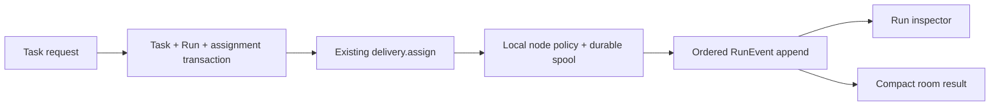

# Durable Task Runs

## Goal

Make a Citadel delegation durable, provider-neutral, observable, and node-authorized without replacing its working room/delivery model.

## ADR

Use an additive SQLite v2 migration in the deployed Node hub. A `Task` owns intent; one `Run` owns an attempt; append-only `RunEvent` rows own activity. A room receives only compact task/result messages. Keep the existing delivery transport as the run-assignment path until DAG scheduling is justified.

The rejected alternatives are a protocol-v2 rewrite, a separate workflow service, per-model adapters, and a 27-table schema. `node:sqlite` remains appropriate: it already supplies the single local database connection and transaction primitive; WAL remains the commit journal. [Node SQLite docs](https://nodejs.org/api/sqlite.html) [SQLite WAL format](https://sqlite.org/walformat.html)

Riskiest assumption: the current delivery envelope can carry a `run` assignment without breaking the Rust node. Prove it with a Node-hub/Rust-node fixture that creates a task, assigns its run, and persists an ordered event before acknowledging completion.

## File map

- `tools/citadel/crates/citadel-store/migrations/0002_task_runs.sql` — additive shared task/run schema.
- `tools/citadel/packages/hub/src/store.mjs` — ordered migrations, task/run/event transactions, node ownership checks.
- `tools/citadel/packages/hub/src/server.mjs` — task API, node approval/presence/state/event handlers, ownership enforcement.
- `tools/citadel/packages/hub/src/wire.mjs` — explicit delivery-state and run-event frames.
- `tools/citadel/packages/hub/src/*.test.mjs` — Node-hub regression and contract tests.
- `tools/citadel/crates/citadel-node/src/{hub.rs,state.rs,main.rs}` — persist-before-ACK, cursor progression, run-event forwarding.
- `tools/citadel/crates/citadel-store/src/lib.rs` — apply shared migration in the Rust reference store.
- `tools/citadel/packages/web/src/{types.ts,api.ts,App.tsx,components/RunPanel.tsx}` — task list/run inspector separated from transcript.

## TDD tasks

1. Add failing Node tests that authenticate two nodes and prove a foreign node cannot post, update delivery state, raise an approval, or update presence for another node’s seat. Add matching handlers and wire constants; run `node --test src/{dispatch,query,wire}.test.mjs`.
2. Add failing migration/store tests for exactly one task/run, ordered/deduplicated run events, terminal result, and a transaction rollback. Add `0002_task_runs.sql` plus versioned Node/Rust migration application; run `node --test src/store.test.mjs` and `cargo test -p citadel-store`.
3. Add a failing node-state test that requires a persisted cursor/delivery before ACK. Persist state atomically in the driver and use the received event cursor rather than the handshake cursor; run `cargo test -p citadel-node`.
4. Add a failing hub-node fixture test for task assignment and a normalized `run.event`. Extend the Rust envelope and node adapter to send lifecycle/activity into ordered run events; run `node --test src/e2e-rust-node.test.mjs`.
5. Add failing web tests for a separate run inspector that never injects activity into the room transcript. Add minimal task/run API/types/panel; run `npm test -- --run` from `packages/web`.
6. Run full Rust, hub, and web suites; run `git diff --check`. No deployment or live database migration occurs in this change.

### Critical Files for Implementation

- tools/citadel/packages/hub/src/store.mjs
- tools/citadel/packages/hub/src/server.mjs
- tools/citadel/crates/citadel-node/src/hub.rs
- tools/citadel/crates/citadel-node/src/main.rs
- tools/citadel/crates/citadel-store/migrations/0002_task_runs.sql
