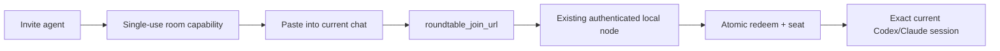

# TASKLIST roundtable-universal-agent-invite-v1

## 0. Control

- **Tasklist ID:** roundtable-universal-agent-invite-v1
- **Created:** 2026-07-30T13:15:00+05:30
- **Purpose:** GOAL_RECORD
- **Owner:** current Codex agent
- **Canonical path:** /Volumes/D/claude/roundtable/docs/plans/2026-07-30-universal-agent-invite.tasklist.md
- **Status:** PLANNED
- **Tasklist revision:** TASKLIST_REVISION:1
- **Goal ID:** NOT_CREATED
- **Scope boundary:** IN:universal invite issue, copy, revoke, node redemption, exact current-session binding, Codex and Claude adapters, future-provider interface, Mac and Windows transport restoration, tests, deployment; OUT:Cloudflare duration repair, multi-tenant accounts, billing, public signup, unrelated Citadel defects
- **Authority:** Adrian requested a Google-Meet-style link pasted into any current agent chat; Windows report requires exact-session attachment and restored WSS/app-server prerequisites

## 1. Goal Contract

- **State A:** STATE_A:Citadel has enrolled Mac/Windows nodes and room seats, but no invite capability or provider-neutral join; web asks for session catalogs the hub never returns, node never publishes catalogs, Claude join is refused, Codex starts a separate app-server, and Windows currently reports WSS 521 plus Codex initialization timeout.
- **State B:** STATE_B:From any active room, Adrian copies one short-lived single-use invite URL, pastes it into the current Codex, Claude, or future-engine chat on an enrolled Mac/Windows node, and that exact chat joins the room without browser/admin/node secrets or a replacement agent session.
- **Success proof:** PROOF_COMMAND:node /Volumes/D/claude/roundtable/tools/roundtable/tests/e2e/invite-join.mjs --production --platforms mac,windows --providers codex,claude --require-current-session; EXPECTED:Exit 0 and PASS for Mac Codex current task, Windows Codex current task, Mac Claude current session, invite expiry, single use, revocation, replay refusal, no secret leakage, and no replacement child session.; EVIDENCE:/Volumes/D/claude/roundtable/docs/evidence/roundtable/invite-join/07-production.json
- **Non-goals:** session catalog as invitation mechanism, new cloud service, provider credentials in URLs, public collaboration accounts, provider engines beyond adapter contract, or cosmetic redesign outside invite control
- **Hard constraints:** AUTHORITY=current user request; SAFETY=hashed short-lived single-use room capability redeemed only by enrolled node; SCOPE=invite and exact-session join plus required runtime repair; QUALITY=real Mac/Windows Codex and Claude current-session acceptance; COST=zero paid calls, new services, or dependencies

## 2. GoalRoute Binding

- **Goal route artifact:** /Volumes/D/claude/roundtable/docs/plans/2026-07-30-universal-agent-invite.route.json
- **Goal route receipt:** /Volumes/D/claude/roundtable/docs/plans/2026-07-30-universal-agent-invite.route.receipt.json
- **Goal route schema:** goal-route.v2
- **Selected route:** SELECTED_ROUTE:R_CAPABILITY_NODE
- **Expected time to verified B:** EXPECTED_TIME_TO_VERIFIED_B_MS:8400000
- **Route revision:** ROUTE_REVISION:1
- **Critical path:** CRITICAL_PATH:R_CAPABILITY_NODE/S1>R_CAPABILITY_NODE/S3>R_CAPABILITY_NODE/S4>R_CAPABILITY_NODE/S6>R_CAPABILITY_NODE/S7
- **Parallel lanes:** PARALLEL_LANES_JSON:[{"id":"root-prerequisites","steps":["R_CAPABILITY_NODE/S1","R_CAPABILITY_NODE/S2"],"reason":"Runtime/session proof and hub invite persistence touch independent initial surfaces."},{"id":"connector-and-ui","steps":["R_CAPABILITY_NODE/S4","R_CAPABILITY_NODE/S5"],"reason":"Local provider connector and browser invite UI depend on separate completed contracts and can proceed independently."}]
- **Deleted work:** DELETED_WORK_JSON:[{"item":"Session catalog as join mechanism","reason":"Catalog listing cannot bind the exact chat where invite URL was pasted."},{"item":"Browser-admin seat provisioning instructions","reason":"Manual provisioning recreates current defect and fails Google-Meet-style flow."},{"item":"Provider or node secrets inside invite URL","reason":"Violates least privilege and turns copied link into a durable machine credential."}]
- **Deferred work:** DEFERRED_WORK_JSON:[{"item":"Additional engine binders beyond Codex and Claude","until":"Stable adapter contract passes current-session acceptance for both existing providers."},{"item":"Optional session catalog observability","until":"Invite flow reaches production State B and a separate user need justifies catalog UI."}]

## 2.1 Architecture Decision

Decision: issue one capability URL from browser, redeem it through existing node authentication, then let a thin provider binder attach exact calling session. Session catalog is optional observability, not join mechanism.

| Mechanism | Adopted pattern | Decision |
|---|---|---|
| Invite security | [OWASP URL-token guidance](https://cheatsheetseries.owasp.org/cheatsheets/Forgot_Password_Cheat_Sheet.html): high entropy, securely stored, expiring, single use | Adapt |
| Cross-device claim | [RFC 8628](https://www.rfc-editor.org/info/rfc8628/): short verification link/code redeemed by authenticated client | Adapt without polling |
| Engine-neutral invocation | [MCP tools](https://modelcontextprotocol.io/specification/2025-11-25/schema): client invokes one local tool with structured arguments | Adopt |
| Codex existing session | Codex App Server `thread/resume` with exact known thread ID; never `thread/start` replacement | Adopt after real identity probe |
| Browser session catalog | Lists sessions but does not prove which current chat invoked join | Reject as join path |

## 3. Execution Tasks

### Task 1 — Restore prerequisites and prove exact session binding

- **Task status:** TODO
- **Route step:** ROUTE_STEP:R_CAPABILITY_NODE/S1
- **Action:** ACTION:Restore Mac and Windows node-to-hub WSS plus installed Codex app-server initialization, then prove exact current-session identity capture for Codex and Claude without spawning a replacement session.
- **Depends on:** START
- **Advances target:** ADVANCES_STATE_B:Both enrolled nodes are live and each provider has a proven exact-current-session binding contract.
- **Done check:** CHECK:node /Volumes/D/claude/roundtable/tools/roundtable/tests/e2e/provider-session-probe.mjs --platforms mac,windows --providers codex,claude --require-current-session
- **Expected result:** EXPECTED:exit 0; WSS connects without 521; installed Codex initializes; probe returns exact current thread/session IDs; no new child session appears
- **Evidence path:** /Volumes/D/claude/roundtable/docs/evidence/roundtable/invite-join/01-prerequisites.json
- **On failure:** TRY:capture bounded node, reverse-proxy, Cloudflare, and app-server protocol logs then repair proven boundary; FALLBACK:prove unaffected platform/provider binders and preserve failing runtime packet; RECOMPILE_IF:Codex or Claude exposes no supported exact-current-session identifier to local tool invocation

### Task 2 — Build secure invite lifecycle

- **Task status:** TODO
- **Route step:** ROUTE_STEP:R_CAPABILITY_NODE/S2
- **Action:** ACTION:Add invite persistence and authenticated browser issue, inspect, revoke, and consume APIs using hashed high-entropy room-scoped single-use tokens with expiry and rate limits.
- **Depends on:** START
- **Advances target:** ADVANCES_STATE_B:Hub can safely issue and lifecycle-manage one room invite capability without exposing operator credentials.
- **Done check:** CHECK:node --test /Volumes/D/claude/roundtable/tools/roundtable/packages/hub/src/invites.test.mjs
- **Expected result:** EXPECTED:exit 0; issue returns token once; DB stores hash only; expiry, revoke, replay, room scope, origin, and rate-limit tests pass
- **Evidence path:** /Volumes/D/claude/roundtable/docs/evidence/roundtable/invite-join/02-invite-api.txt
- **On failure:** TRY:repair failing store/API invariant without widening route; FALLBACK:run store and HTTP layers independently to isolate boundary; RECOMPILE_IF:invite requires new identity service or external datastore

### Task 3 — Redeem through enrolled node

- **Task status:** TODO
- **Route step:** ROUTE_STEP:R_CAPABILITY_NODE/S3
- **Action:** ACTION:Add node-authenticated invite redemption frames and IPC requests that atomically consume a capability and create or recover one idempotent room seat bound to the calling session.
- **Depends on:** AFTER:R_CAPABILITY_NODE/S1,R_CAPABILITY_NODE/S2
- **Advances target:** ADVANCES_STATE_B:An enrolled node can redeem one invite into exactly one least-privilege seat for the proven calling-session identity.
- **Done check:** CHECK:cargo test --manifest-path /Volumes/D/claude/roundtable/tools/roundtable/Cargo.toml -p roundtable-node invite_join -- --nocapture
- **Expected result:** EXPECTED:exit 0; valid redeem creates one seat; retry returns same seat; wrong node, expired, revoked, replayed, and cross-room tokens fail closed
- **Evidence path:** /Volumes/D/claude/roundtable/docs/evidence/roundtable/invite-join/03-node-redemption.txt
- **On failure:** TRY:trace one invite ID across IPC, node frame, transaction, and ACK; FALLBACK:run deterministic fake-hub integration with persisted token snapshot; RECOMPILE_IF:atomic consume and seat creation cannot share current SQLite transaction boundary

### Task 4 — Bind pasted link to exact current chat

- **Task status:** TODO
- **Route step:** ROUTE_STEP:R_CAPABILITY_NODE/S4
- **Action:** ACTION:Build one local roundtable_join_url MCP channel with provider binders that resume the exact Codex thread, bind the exact Claude channel connection, and expose a stable adapter interface for future engines.
- **Depends on:** AFTER:R_CAPABILITY_NODE/S3
- **Advances target:** ADVANCES_STATE_B:Pasting an invite into a supported current chat invokes one provider-neutral join tool and binds that exact chat to its seat.
- **Done check:** CHECK:npm test --prefix /Volumes/D/claude/roundtable/tools/roundtable/packages/join-channel
- **Expected result:** EXPECTED:exit 0; one tool schema handles Codex and Claude; Codex uses thread/resume with captured ID; Claude uses calling IPC connection; unknown provider returns typed unsupported error
- **Evidence path:** /Volumes/D/claude/roundtable/docs/evidence/roundtable/invite-join/04-agent-channel.txt
- **On failure:** TRY:repair provider binder behind unchanged join contract; FALLBACK:validate node redemption and one proven provider independently; RECOMPILE_IF:provider requires user-visible identifier entry or replacement session

### Task 5 — Replace dead attachment UI with invite control

- **Task status:** TODO
- **Route step:** ROUTE_STEP:R_CAPABILITY_NODE/S5
- **Action:** ACTION:Replace the dead Attach session control with an accessible Invite agent control that creates, copies, displays expiry, and revokes a room invite without exposing its token after creation.
- **Depends on:** AFTER:R_CAPABILITY_NODE/S2
- **Advances target:** ADVANCES_STATE_B:Every active room has a visible Google-Meet-style invite action with secure lifecycle controls.
- **Done check:** CHECK:/Volumes/D/claude/roundtable/tools/roundtable/packages/web/node_modules/.bin/vitest run /Volumes/D/claude/roundtable/tools/roundtable/packages/web/src/components/InviteAgent.test.tsx /Volumes/D/claude/roundtable/tools/roundtable/packages/web/src/App.test.tsx
- **Expected result:** EXPECTED:exit 0; visible Invite agent control copies once, shows expiry, supports revoke, keyboard/focus/ARIA checks pass, dead Attach session control is absent
- **Evidence path:** /Volumes/D/claude/roundtable/docs/evidence/roundtable/invite-join/05-pwa.txt
- **On failure:** TRY:fix focused component/API contract and rerun two tests; FALLBACK:verify API lifecycle separately while preserving UI failure artifact; RECOMPILE_IF:browser must retain invite token beyond one display

### Task 6 — Prove real cross-platform pasted-link flow

- **Task status:** TODO
- **Route step:** ROUTE_STEP:R_CAPABILITY_NODE/S6
- **Action:** ACTION:Run deterministic contract, security, reconnect, and real cross-platform pasted-link tests for Mac Codex, Windows Codex, and Claude current sessions.
- **Depends on:** AFTER:R_CAPABILITY_NODE/S4,R_CAPABILITY_NODE/S5
- **Advances target:** ADVANCES_STATE_B:Local and real-device evidence proves exact-session joins plus expiry, revocation, replay refusal, reconnect, and secret boundaries.
- **Done check:** CHECK:node /Volumes/D/claude/roundtable/tools/roundtable/tests/e2e/invite-join.mjs --platforms mac,windows --providers codex,claude --require-current-session
- **Expected result:** EXPECTED:exit 0; copied link joins exact current chats on both nodes; room message round-trip succeeds; reconnect preserves seat; negative security matrix passes
- **Evidence path:** /Volumes/D/claude/roundtable/docs/evidence/roundtable/invite-join/06-cross-platform.json
- **On failure:** TRY:isolate transport, redemption, provider binding, or delivery boundary from structured trace; FALLBACK:retain passing platform/provider matrix and repair one failing seam; RECOMPILE_IF:real client behavior contradicts provider identity contract from Task 1

### Task 7 — Deploy and verify production

- **Task status:** TODO
- **Route step:** ROUTE_STEP:R_CAPABILITY_NODE/S7
- **Action:** ACTION:Deploy the verified hub, PWA, and Mac/Windows node integrations, then run production pasted-link acceptance and rollback checks.
- **Depends on:** AFTER:R_CAPABILITY_NODE/S6
- **Advances target:** ADVANCES_STATE_B:Production Citadel reaches State B with sealed live acceptance evidence and a tested rollback.
- **Done check:** CHECK:node /Volumes/D/claude/roundtable/tools/roundtable/tests/e2e/invite-join.mjs --production --platforms mac,windows --providers codex,claude --require-current-session
- **Expected result:** EXPECTED:exit 0 and PASS for Mac Codex current task, Windows Codex current task, Mac Claude current session, invite expiry, single use, revocation, replay refusal, no secret leakage, and no replacement child session.
- **Evidence path:** /Volumes/D/claude/roundtable/docs/evidence/roundtable/invite-join/07-production.json
- **On failure:** TRY:rollback hub/PWA/node to sealed prior artifacts and repair proven deployment seam; FALLBACK:keep production on prior version with full failure evidence; RECOMPILE_IF:production topology or provider versions differ materially from validated matrix

## 4. Recovery & TRUE_BLOCKER

- **Retry contract:** deterministic validation defects get zero blind retries; transient WSS/SSH/Cloudflare failures get two bounded retries with captured status; auth, schema, or provider-contract failures are fatal until repaired
- **Alternative route policy:** RECOMPILE_GOAL_ROUTE_IF:selected capability-node route cannot attach exact current chat or a lower-expected constraint-passing route becomes available
- **TRUE_BLOCKER allowed only if:** RECOVERY_EXHAUSTED; INDEPENDENT_WORK_COMPLETE; NO_FEASIBLE_ROUTE; ONE_MISSING_EXTERNAL_INPUT
- **Blocked artifact path:** /Volumes/D/claude/roundtable/docs/evidence/roundtable/invite-join/blocked.md
- **Blocked artifact fields:** SYMPTOM; ATTEMPTS; MISSING_INPUT; UNBLOCK_CHANGE; RESUME_ACTION; OWNER

## 5. Progress & Change Control

- **Boundary update rule:** BEFORE=IN_PROGRESS; PASS=DONE_WITH_EVIDENCE; RECOVERABLE_FAILURE=IN_PROGRESS_WITH_ATTEMPT
- **Receipt update rule:** REWRITE_RECEIPT_AFTER_EVERY_DURABLE_TASKLIST_CHANGE
- **Semantic correction:** STOP -> PRESERVE_EVIDENCE -> RECOMPILE_ROUTE_FROM_ROOT -> REBUILD_TASKS -> NEW_RECEIPTS
- **Resume rule:** VERIFY_TASKLIST_RECEIPT -> VERIFY_ROUTE_RECEIPT -> CONFIRM_FIRST_NON_DONE_TASK -> CONTINUE

## 6. Completion Contract

- **Final verification:** node /Volumes/D/claude/roundtable/tools/roundtable/tests/e2e/invite-join.mjs --production --platforms mac,windows --providers codex,claude --require-current-session
- **Final expected result:** Exit 0 and PASS for Mac Codex current task, Windows Codex current task, Mac Claude current session, invite expiry, single use, revocation, replay refusal, no secret leakage, and no replacement child session.
- **Final evidence path:** /Volumes/D/claude/roundtable/docs/evidence/roundtable/invite-join/07-production.json
- **Completion rule:** ALL_TASKS_DONE_AND_FINAL_PROOF_PASS_BEFORE_STATUS_COMPLETE
- **Terminal record:** STATUS=PLANNED; DONE=0/7; NEXT=R_CAPABILITY_NODE/S1
